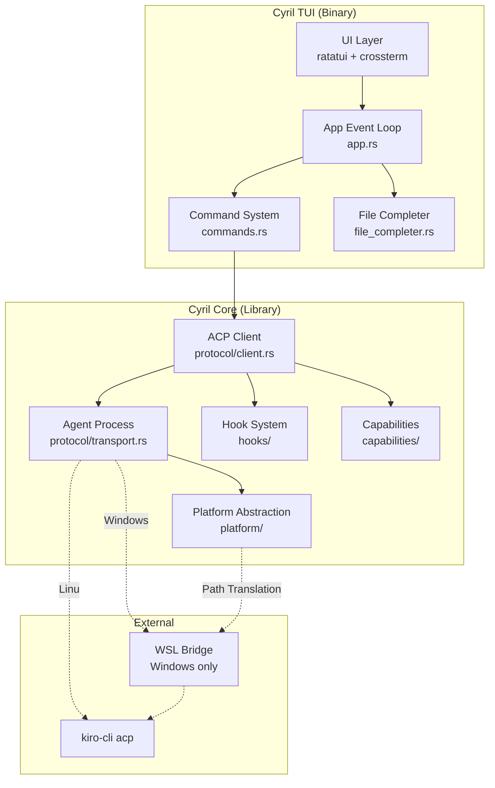
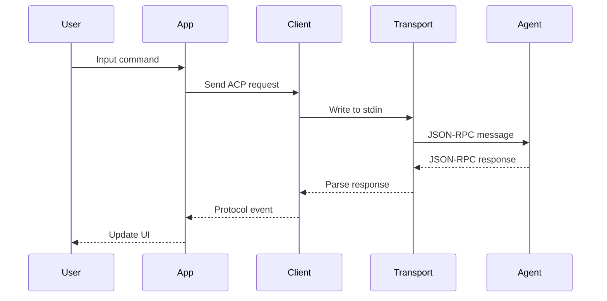
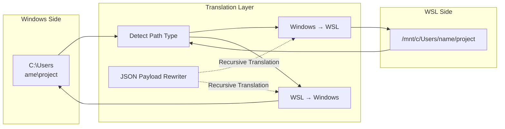
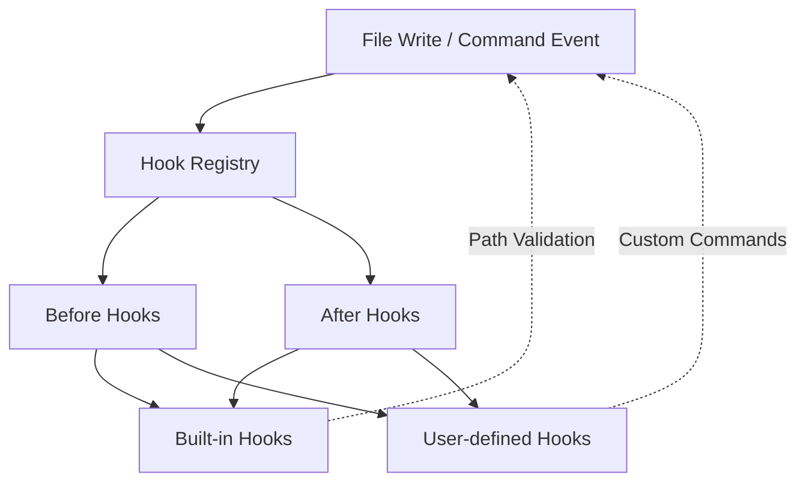
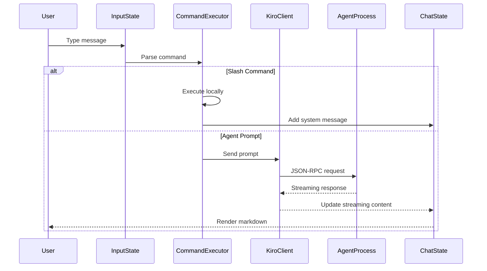
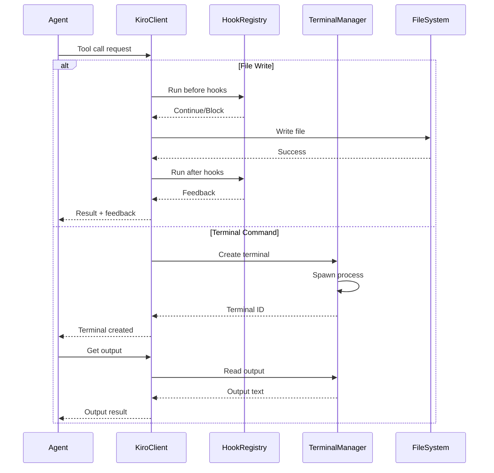

# System Architecture

## Overview

Cyril follows a clean separation of concerns with a two-crate architecture that isolates platform-specific logic from the TUI presentation layer. The system communicates with Kiro CLI via the Agent Client Protocol (ACP) using JSON-RPC 2.0 over stdio.

## High-Level Architecture

## Architectural Layers

### 1. Presentation Layer (cyril crate)

**Responsibility:** User interface and interaction handling

**Key Components:**
- `main.rs` - Entry point, CLI parsing, mode selection
- `app.rs` - Main event loop and state management
- `commands.rs` - Slash command parsing and execution
- `ui/` - UI component modules

**Design Patterns:**
- Event-driven architecture
- Component-based UI rendering
- State machine for interaction flows

### 2. Protocol Layer (cyril-core)

**Responsibility:** ACP communication and protocol handling

**Key Components:**
- `protocol/client.rs` - ACP client implementation
- `protocol/transport.rs` - Process spawning and stdio management
- `event.rs` - Event type definitions

**Communication Flow:**

### 3. Platform Abstraction Layer (cyril-core)

**Responsibility:** OS-specific functionality and path translation

**Key Components:**
- `platform/path.rs` - Bidirectional path translation (Windows ↔ WSL)
- `platform/terminal.rs` - Terminal process management

**Path Translation Architecture:**

### 4. Hook System (cyril-core)

**Responsibility:** Extensible event-driven automation

**Architecture:**

**Hook Execution Flow:**
1. Event triggered (file write, terminal command)
2. Registry matches hooks by glob pattern
3. Before hooks execute (can block operation)
4. Main operation executes
5. After hooks execute (provide feedback)

### 5. Capabilities Layer (cyril-core)

**Responsibility:** File system operations and agent capabilities

**Key Components:**
- `capabilities/fs.rs` - File read/write operations

## Data Flow Architecture

### User Input → Agent Response

### Tool Call Execution

## Design Principles

### 1. Separation of Concerns
- **UI logic** isolated in `cyril` crate
- **Protocol logic** isolated in `cyril-core` crate
- **Platform-specific code** contained in `platform/` module

### 2. Event-Driven Architecture
- All interactions flow through event system
- Async/await for non-blocking I/O
- Channel-based communication between components

### 3. Cross-Platform Abstraction
- Platform detection at runtime
- Transparent path translation
- Unified API regardless of OS

### 4. Extensibility
- Hook system for custom automation
- Plugin-like architecture for capabilities
- JSON-based configuration

### 5. Testability
- Comprehensive unit tests (50+ test functions)
- Mock-friendly interfaces
- Isolated component testing

## Key Architectural Decisions

### Why Two Crates?
- **Reusability:** Core logic can be used by other clients
- **Testing:** Easier to test protocol logic independently
- **Compilation:** Faster incremental builds
- **Clarity:** Clear boundary between UI and business logic

### Why Event-Driven?
- **Responsiveness:** Non-blocking UI updates
- **Flexibility:** Easy to add new event types
- **Decoupling:** Components don't need direct references

### Why Hook System?
- **Extensibility:** Users can customize behavior without code changes
- **Transparency:** Agent doesn't need to know about hooks
- **Safety:** Hooks run at protocol boundary with validation

### Why Path Translation?
- **Windows Support:** Enables Windows users without native kiro-cli
- **Seamless UX:** Users work with native paths
- **Correctness:** Ensures paths work in both environments

## Performance Considerations

### Streaming Rendering
- Incremental markdown parsing
- Efficient diff computation for tool calls
- Bounded message history (prevents memory growth)

### Terminal Management
- Output capping to prevent memory exhaustion
- Async I/O for non-blocking reads
- Process cleanup on terminal release

### Path Translation
- Lazy translation (only when needed)
- Caching for repeated translations
- Efficient JSON traversal

## Security Considerations

### Approval System
- User must approve file writes
- User must approve terminal commands
- Clear display of what will be executed

### Hook Validation
- Path validation built-in hook
- Glob pattern matching for safety
- Error handling prevents hook failures from breaking operations

### Process Isolation
- Terminal processes run in separate context
- No shell injection vulnerabilities
- Proper process cleanup
