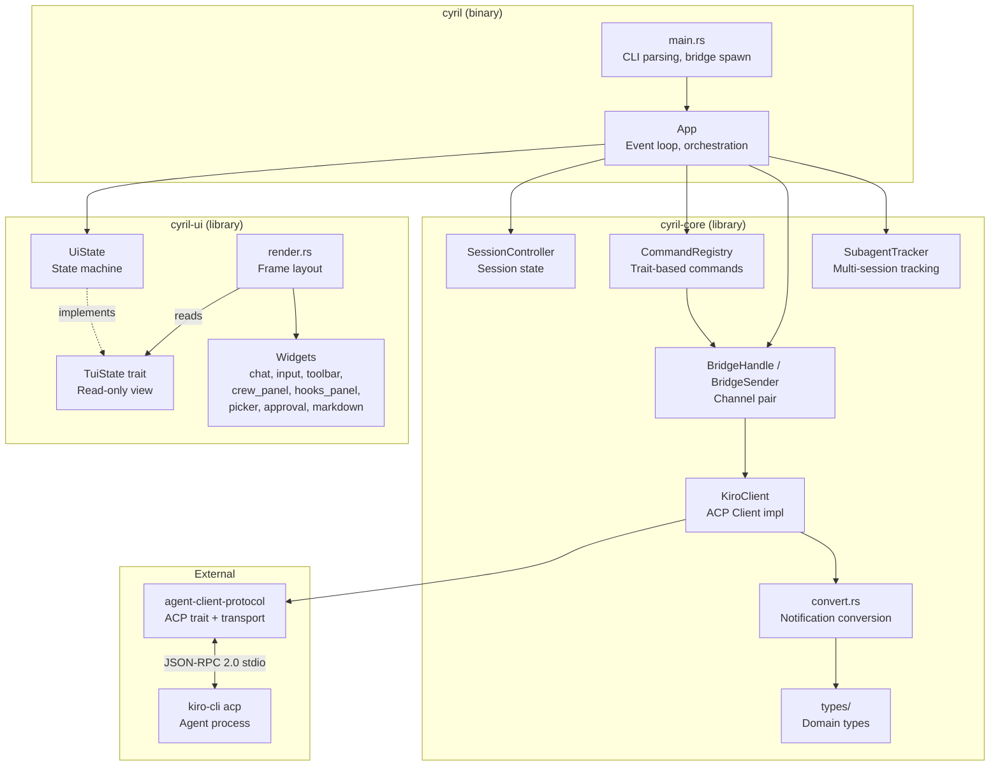
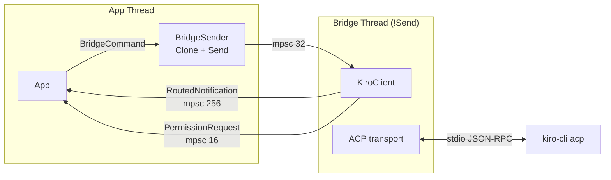
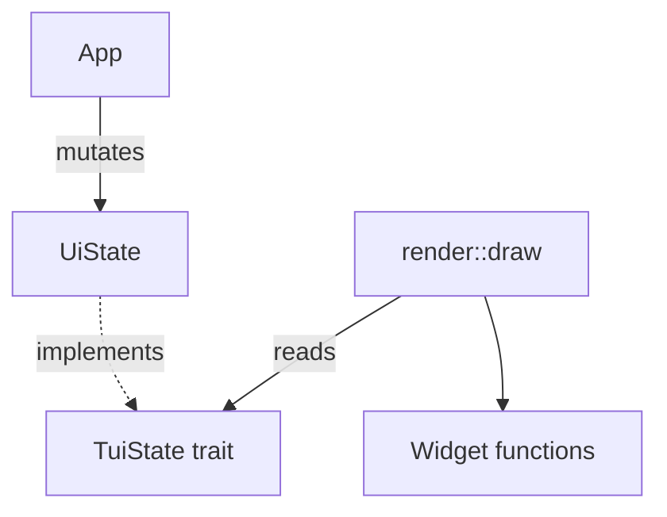
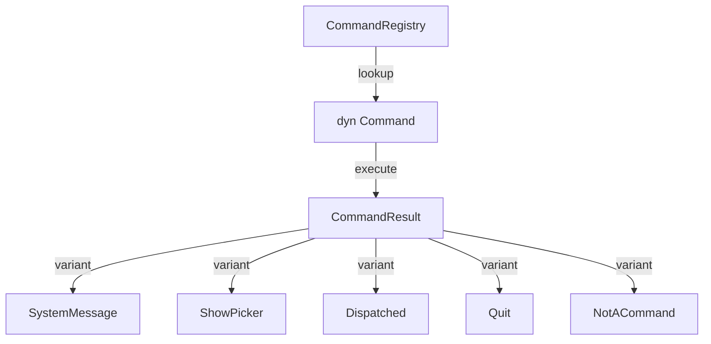
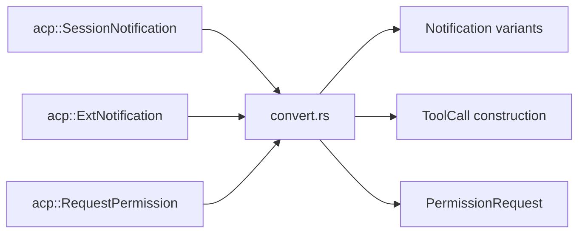
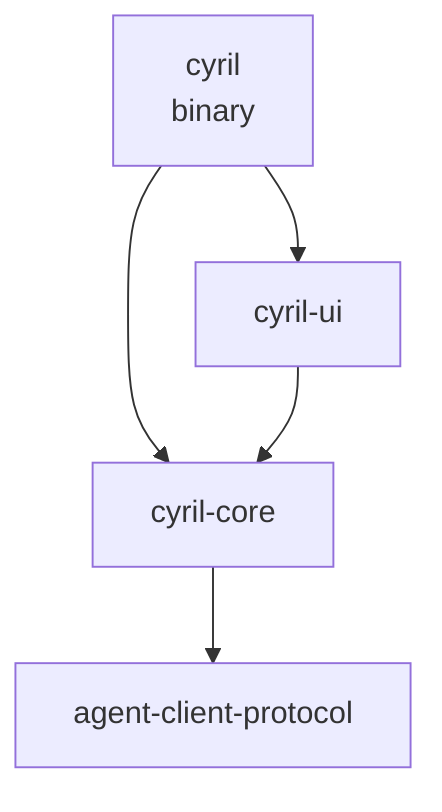
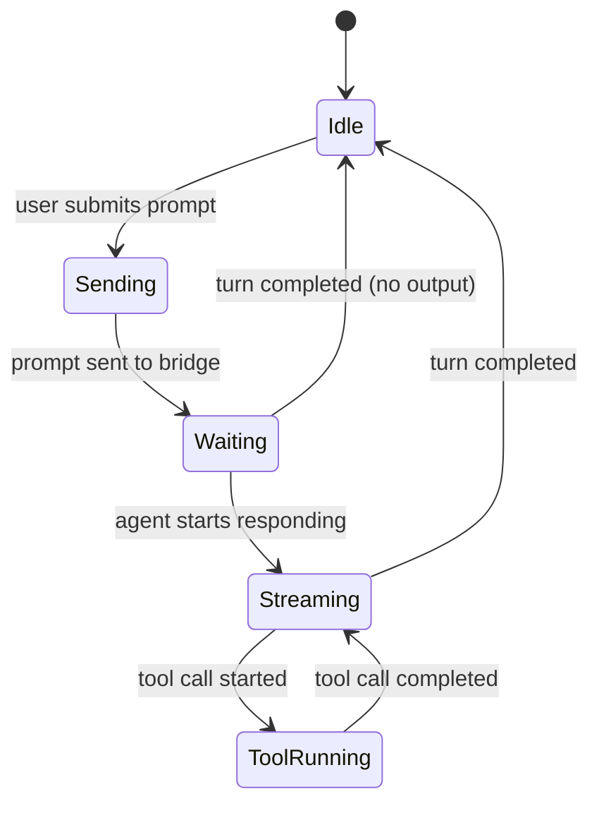

# Architecture

> Generated: 2026-04-11 | Codebase: Cyril

## System Overview

Cyril is a three-crate Rust workspace that implements a TUI frontend for Kiro CLI over the Agent Client Protocol (ACP). The architecture separates concerns into protocol logic (`cyril-core`), UI state and rendering (`cyril-ui`), and application orchestration (`cyril`).

## Core Architectural Patterns

### Bridge Pattern (Channel-Based IPC)

The bridge is the central communication hub between the App and the ACP agent process. It uses three async channels:

- `BridgeCommand` — App → Bridge: prompts, session control, agent commands
- `RoutedNotification` — Bridge → App: agent output, tool calls, metadata
- `PermissionRequest` — Bridge → App: approval dialogs (oneshot response)

`BridgeHandle` is split into `BridgeSender` (cloneable, passed to commands) and two receivers consumed by `tokio::select!` in the event loop.

### Routed Notification System

Every notification from the ACP bridge carries an optional `session_id` for routing:

- `session_id == None` → global notification (bridge lifecycle, subagent list updates)
- `session_id == Some(id)` matching main session → dispatched to main state machines
- `session_id == Some(id)` not matching main → routed to `SubagentUiState`

This enables multi-session support where the main session and subagent sessions share a single bridge connection.

### State / Renderer Separation (TuiState Trait)

The renderer receives `&dyn TuiState` — a read-only trait — and cannot mutate application state. `UiState` implements `TuiState` and owns all mutable UI state.

This enforces a unidirectional data flow: mutations happen in the App event loop, rendering is a pure function of state.

### Command Registry Pattern

Commands are registered as trait objects implementing `Command`:

Builtin commands (`help`, `clear`, `quit`, `new`, `load`) are registered at startup. Agent commands from the server are dynamically registered via `register_agent_commands()`. Subagent commands (`spawn`, `kill`, `msg`, `sessions`) are registered separately.

### Notification Conversion Layer

`convert.rs` is the largest file in the codebase. It translates raw ACP protocol messages into typed `Notification` variants:

The conversion layer also maintains a `tool_call_inputs` cache (via `RefCell<HashMap>`) because permission requests arrive without `raw_input` — the client looks it up from previously cached tool call notifications.

## Crate Dependency Graph

`cyril-core` has no dependency on `cyril-ui`. The binary crate depends on both.

## Event Loop Architecture

The App's `run()` method uses `tokio::select!` with biased priority:

1. **Terminal input** (highest) — keyboard/mouse events from crossterm
2. **Permission requests** — approval dialogs from the bridge
3. **Notifications** — agent output, tool calls, metadata updates
4. **Redraw timer** — adaptive frame rate based on `Activity` state

The `Activity` enum drives adaptive frame rate: `Idle` redraws at 500ms, `Streaming` at 33ms (30fps).
