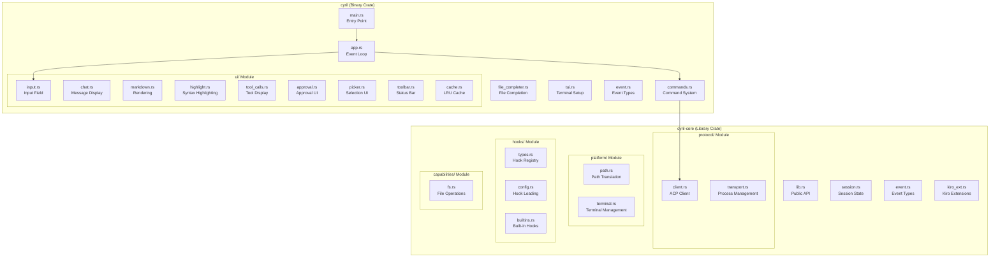
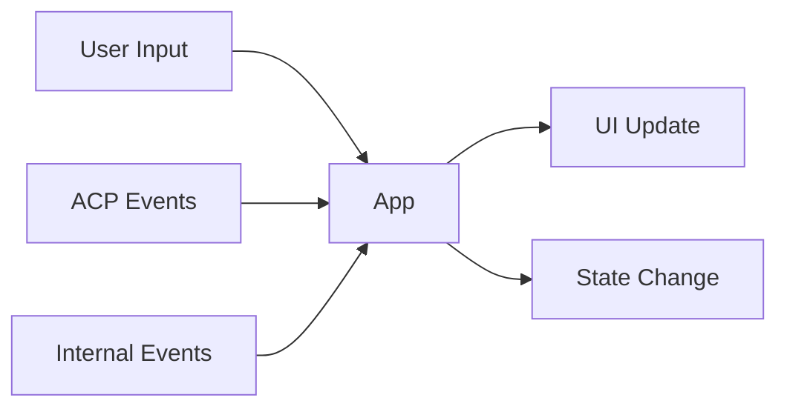
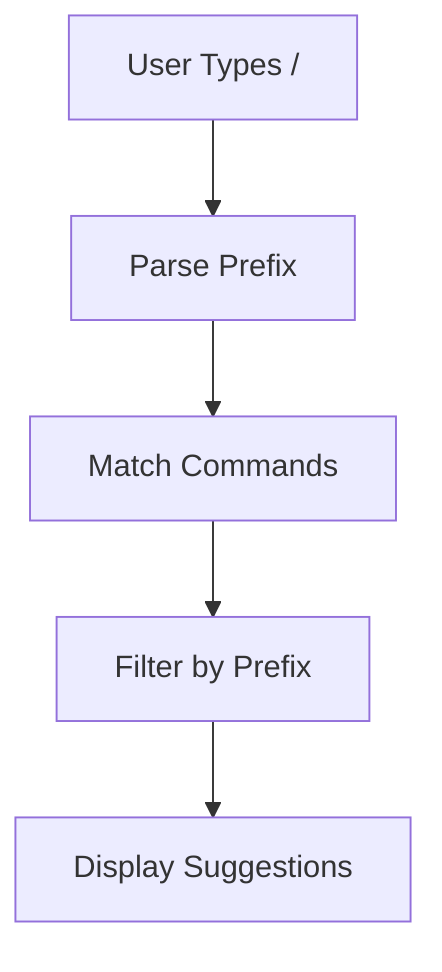
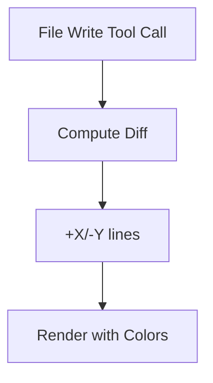
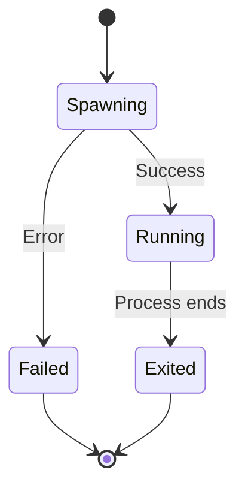
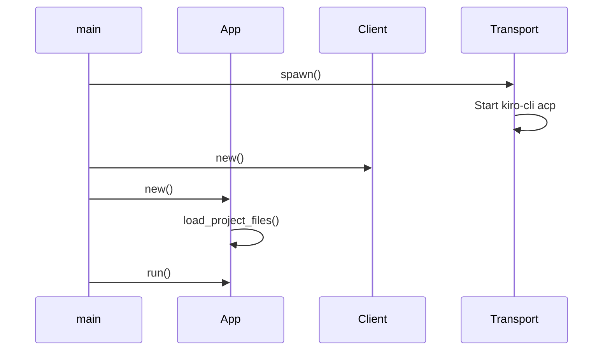
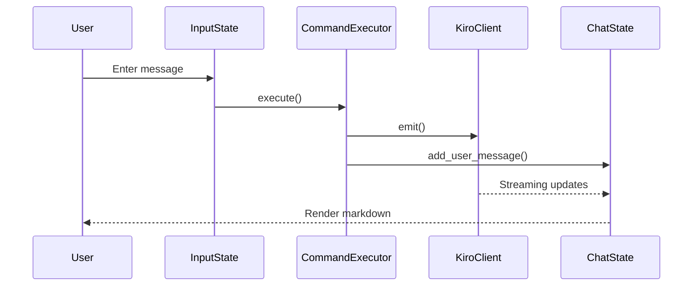
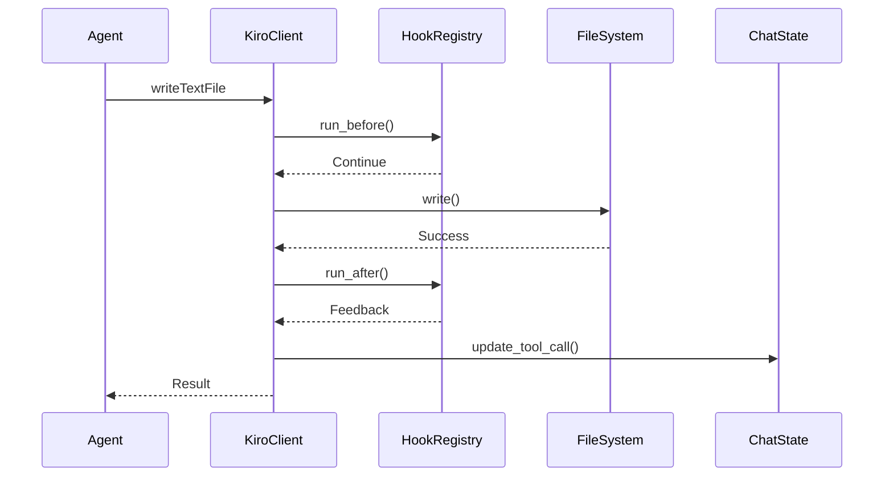

# Components

## Overview

Cyril is organized into two main crates with distinct responsibilities. This document details the major components, their responsibilities, and interactions.

## Crate Structure



## Binary Crate Components (cyril)

### Core Application Components

#### main.rs (245 LOC)
**Responsibility:** Application entry point and initialization

**Key Functions:**
- `main()` - CLI argument parsing, connection setup
- `run_tui()` - Launch interactive TUI mode
- `run_oneshot()` - Execute single prompt and exit
- `connect()` - Establish connection to agent process

**Dependencies:**
- `clap` for CLI parsing
- `cyril-core` for protocol client
- `tokio` for async runtime

**Usage Pattern:**
```rust
// CLI modes
cyril                              // Interactive TUI
cyril --prompt "question"          // One-shot mode
cyril -d /path/to/project          // Custom working directory
```

---

#### app.rs (459 LOC)
**Responsibility:** Main event loop and application state management

**Key Struct:** `App`
- Manages all UI component states
- Coordinates event handling
- Orchestrates rendering

**Key Methods:**
- `new()` - Initialize application state
- `run()` - Main event loop
- `handle_event()` - Route events to handlers
- `handle_key()` - Process keyboard input
- `handle_acp_event()` - Process ACP protocol events
- `render()` - Coordinate UI rendering

**Event Flow:**


**State Management:**
- Chat history and streaming state
- Input field state with autocomplete
- Tool call tracking
- Approval workflow state
- Session context (model, mode, usage)

---

#### commands.rs (905 LOC) ⭐ Most Complex
**Responsibility:** Command parsing, execution, and autocomplete

**Key Structs:**
- `CommandExecutor` - Executes commands and manages channels
- `SlashCommand` - Built-in slash commands
- `AgentCommand` - Agent-provided commands
- `ParsedCommand` - Parsed command result
- `Suggestion` - Autocomplete suggestion

**Slash Commands:**
- `/help` - Show available commands
- `/new` - Start new session
- `/load <id>` - Load session
- `/clear` - Clear chat
- `/quit` - Exit application
- `/model <name>` - Set model
- `/mode <name>` - Set mode

**Key Methods:**
- `parse_command()` - Parse input into command
- `execute()` - Execute parsed command
- `matching_suggestions()` - Generate autocomplete suggestions
- `send_prompt()` - Send message to agent
- `load_session()` - Load previous session
- `set_model()` - Change active model

**Autocomplete System:**


---

#### file_completer.rs (183 LOC)
**Responsibility:** File reference completion with @ trigger

**Key Structs:**
- `FileCompleter` - Manages file suggestions
- `FileSuggestion` - Individual file suggestion
- `AtContext` - Parsed @ context

**Features:**
- Detects `@` trigger in input
- Loads project files on demand
- Fuzzy matching for file paths
- Caches file list for performance

**Usage Pattern:**
```
User types: "Review @src/m"
Completer suggests: @src/main.rs, @src/markdown.rs
```

---

### UI Components (ui/ module)

#### input.rs (299 LOC)
**Responsibility:** Input field with autocomplete popups

**Key Struct:** `InputState`
- Text area widget wrapper
- Command autocomplete popup
- File autocomplete popup
- Suggestion navigation

**Key Methods:**
- `render()` - Draw input field and popups
- `apply_suggestion()` - Accept autocomplete
- `autocomplete_up/down()` - Navigate suggestions
- `take_input()` - Extract entered text

**Popup Types:**
- Command popup (slash commands)
- File popup (@ references)

---

#### chat.rs (287 LOC)
**Responsibility:** Message display and chat history

**Key Struct:** `ChatState`
- Message history with roles
- Streaming content buffer
- Tool call tracking
- Scroll position

**Message Types:**
- User messages
- Assistant messages (streaming/complete)
- System messages
- Tool call updates

**Key Methods:**
- `add_user_message()` - Add user input
- `begin_streaming()` - Start assistant response
- `append_streaming()` - Add streaming content
- `finish_streaming()` - Complete response
- `scroll_up/down()` - Navigate history

---

#### markdown.rs (243 LOC)
**Responsibility:** Markdown rendering to terminal

**Features:**
- Pulldown-cmark parser integration
- Inline formatting (bold, italic, code)
- Code blocks with syntax highlighting
- Lists and headings
- Line wrapping

**Rendering Pipeline:**
```mermaid
graph LR
    MD[Markdown Text] --> Parser[pulldown-cmark]
    Parser --> Render[render()]
    Render --> Style[Apply Styles]
    Style --> Highlight[Syntax Highlight]
    Highlight --> Lines[Terminal Lines]
```

---

#### highlight.rs (116 LOC)
**Responsibility:** Syntax highlighting for code blocks

**Features:**
- Syntect integration
- Language detection
- Color conversion (syntect → ratatui)
- Diff highlighting with color tinting

**Supported Languages:**
- Rust, Python, JavaScript, TypeScript
- Go, Java, C/C++, C#
- Shell, JSON, YAML, TOML
- And more via syntect

---

#### tool_calls.rs (291 LOC)
**Responsibility:** Tool call tracking and visualization

**Key Struct:** `TrackedToolCall`
- Tool call ID and status
- Display label and kind
- Primary path (for file operations)
- Diff content (for file writes)

**Tool Call Types:**
- File read
- File write (with diff)
- Terminal command
- Other tool calls

**Diff Visualization:**


---

#### approval.rs (203 LOC)
**Responsibility:** Approval prompt UI

**Key Struct:** `ApprovalState`
- Request details
- Available options (Approve/Deny/etc.)
- Selected option

**Features:**
- Centered modal display
- Keyboard navigation
- Detail extraction from requests
- Option selection

---

#### picker.rs (171 LOC)
**Responsibility:** Generic selection picker UI

**Key Struct:** `PickerState<T>`
- Generic over option type
- Scrollable list
- Keyboard navigation

**Usage:**
- Model selection
- Mode selection
- Other selection workflows

---

#### toolbar.rs (139 LOC)
**Responsibility:** Status bar display

**Key Struct:** `ToolbarState`
- Session ID
- Current model
- Current mode
- Context usage percentage

**Display:**
```
Session: abc123 | Model: claude-3.5-sonnet | Mode: default | Context: 45%
```

---

#### cache.rs (89 LOC)
**Responsibility:** LRU cache utility

**Key Struct:** `HashCache<K, V>`
- Generic key-value cache
- LRU eviction policy
- Configurable capacity

**Usage:**
- Caching file completions
- Caching computed values

---

## Library Crate Components (cyril-core)

### Protocol Components

#### protocol/client.rs (358 LOC)
**Responsibility:** ACP client implementation

**Key Struct:** `KiroClient`
- ACP protocol client
- Request/response handling
- Notification emission

**Key Methods:**
- `new()` - Create client instance
- `emit()` - Send ACP request
- `request_permission()` - Request user approval
- `read_text_file()` - Read file capability
- `write_text_file()` - Write file capability
- `create_terminal()` - Create terminal process
- `terminal_output()` - Get terminal output
- `session_notification()` - Send session update
- `ext_notification()` - Send extension notification

**ACP Methods Implemented:**
- `acp/requestPermission`
- `acp/readTextFile`
- `acp/writeTextFile`
- `acp/createTerminal`
- `acp/terminalOutput`
- `acp/waitForTerminalExit`
- `acp/releaseTerminal`
- `acp/killTerminal`

---

#### protocol/transport.rs (161 LOC)
**Responsibility:** Agent process management

**Key Struct:** `AgentProcess`
- Process spawning
- Stdio management
- Stderr monitoring

**Key Methods:**
- `spawn()` - Start agent process
- `take_stdin()` - Get stdin handle
- `take_stdout()` - Get stdout handle
- `drain_stderr()` - Read stderr output
- `try_wait()` - Check process status
- `check_startup()` - Verify successful start

**Process Lifecycle:**


---

### Platform Components

#### platform/path.rs (306 LOC)
**Responsibility:** Bidirectional path translation

**Key Enum:** `Direction`
- `ToNative` - WSL → Windows
- `ToAgent` - Windows → WSL

**Key Functions:**
- `win_to_wsl()` - Convert Windows path to WSL
- `wsl_to_win()` - Convert WSL path to Windows
- `translate_paths_in_json()` - Recursive JSON translation
- `looks_like_windows_path()` - Path detection
- `looks_like_wsl_mount_path()` - Mount path detection

**Translation Rules:**
- `C:\path` → `/mnt/c/path`
- `/mnt/c/path` → `C:\path`
- Extended prefix handling (`\\?\`)
- UNC path preservation (`\\server\share`)

**Test Coverage:** 18 test functions

---

#### platform/terminal.rs (361 LOC) ⭐ Highly Complex
**Responsibility:** Terminal process management

**Key Structs:**
- `TerminalManager` - Manages terminal processes
- `TerminalProcess` - Individual terminal instance
- `TerminalId` - Unique terminal identifier
- `Shell` - Shell type enum

**Key Methods:**
- `create_terminal()` - Spawn new terminal
- `get_output()` - Read terminal output
- `wait_for_exit()` - Wait for completion
- `release()` - Clean up terminal
- `kill()` - Force terminate
- `detect_shell()` - Detect available shell

**Supported Shells:**
- bash
- zsh
- fish
- pwsh (PowerShell)

**Output Management:**
- Output capping (prevents memory exhaustion)
- Multibyte character boundary respect
- Truncation with prefix indicator

**Test Coverage:** 10 test functions

---

### Hook Components

#### hooks/config.rs (452 LOC) ⭐ Most Complex in Core
**Responsibility:** Hook configuration and execution

**Key Structs:**
- `HooksConfig` - Root configuration
- `ShellHookDef` - Hook definition from JSON
- `ShellHook` - Executable hook instance
- `GlobFilter` - Path pattern matching

**Hook Definition:**
```json
{
  "name": "Format on save",
  "event": "afterWrite",
  "pattern": "*.rs",
  "command": "rustfmt {{file}}"
}
```

**Key Methods:**
- `load_hooks_config()` - Load hooks.json
- `parse_event()` - Parse event type
- `from_def()` - Create hook from definition
- `matches_path()` - Check glob pattern
- `expand_command()` - Replace placeholders
- `run()` - Execute hook command

**Event Types:**
- `beforeWrite` - Before file write
- `afterWrite` - After file write
- `beforeCommand` - Before terminal command
- `afterCommand` - After terminal command

**Test Coverage:** 13 test functions

---

#### hooks/types.rs (101 LOC)
**Responsibility:** Hook registry and execution framework

**Key Structs:**
- `HookRegistry` - Manages registered hooks
- `HookContext` - Execution context
- `HookResult` - Execution result
- `HookTiming` - Before/After enum
- `HookTarget` - Write/Command enum

**Key Methods:**
- `new()` - Create registry
- `register()` - Add hook
- `run_before()` - Execute before hooks
- `run_after()` - Execute after hooks

**Execution Model:**
- Before hooks can block operations
- After hooks provide feedback
- Hooks run sequentially
- Errors are logged but don't fail operations

---

#### hooks/builtins.rs (41 LOC)
**Responsibility:** Built-in hooks

**Key Struct:** `PathValidationHook`
- Validates file paths before writes
- Ensures paths are within allowed directories
- Prevents path traversal attacks

---

### Capability Components

#### capabilities/fs.rs (73 LOC)
**Responsibility:** File system operations

**Key Functions:**
- `read_text_file()` - Read file content
- `write_text_file()` - Write file with parent directory creation

**Features:**
- Automatic parent directory creation
- UTF-8 encoding
- Error handling with context

**Test Coverage:** 4 test functions

---

### Session Components

#### session.rs (216 LOC)
**Responsibility:** Session state management

**Key Structs:**
- `SessionContext` - Session state
- `AvailableMode` - Mode definition

**State Tracked:**
- Session ID
- Current model (with optimistic updates)
- Available modes
- Current mode ID
- Context usage percentage

**Key Methods:**
- `new()` - Create empty context
- `set_session_id()` - Update session
- `set_config_options()` - Update from agent
- `set_optimistic_model()` - Optimistic model update
- `current_model()` - Get active model
- `set_modes()` - Update available modes
- `set_context_usage_pct()` - Update usage

**Test Coverage:** 7 test functions

---

### Extension Components

#### kiro_ext.rs (196 LOC)
**Responsibility:** Kiro-specific extensions

**Key Structs:**
- `KiroExtCommand` - Command definition
- `KiroCommandMeta` - Command metadata
- `KiroCommandsPayload` - Commands notification payload

**Features:**
- Parse Kiro extension commands
- Determine if command is executable
- Support multiple payload formats

**Test Coverage:** 7 test functions

---

## Component Interaction Patterns

### Startup Flow


### Message Send Flow


### Tool Call Flow


## Testing Strategy

### Unit Tests
- **Path translation:** 18 tests
- **Terminal management:** 10 tests
- **Hook system:** 13 tests
- **Commands:** 15 tests
- **Session:** 7 tests
- **Kiro extensions:** 7 tests
- **File operations:** 4 tests
- **Cache:** 4 tests

### Test Patterns
- Roundtrip testing (path translation)
- Edge case coverage (empty, invalid, boundary)
- Mock-friendly design
- Isolated component testing

## Component Dependencies

### External Dependencies by Component
- **UI Components:** ratatui, crossterm, tui-textarea
- **Markdown:** pulldown-cmark
- **Syntax Highlighting:** syntect
- **Protocol:** agent-client-protocol
- **Async:** tokio
- **Serialization:** serde, serde_json
- **CLI:** clap
- **Errors:** anyhow, thiserror
- **Logging:** tracing
- **Fuzzy Matching:** nucleo-matcher
- **Diff:** similar
- **Glob:** glob
