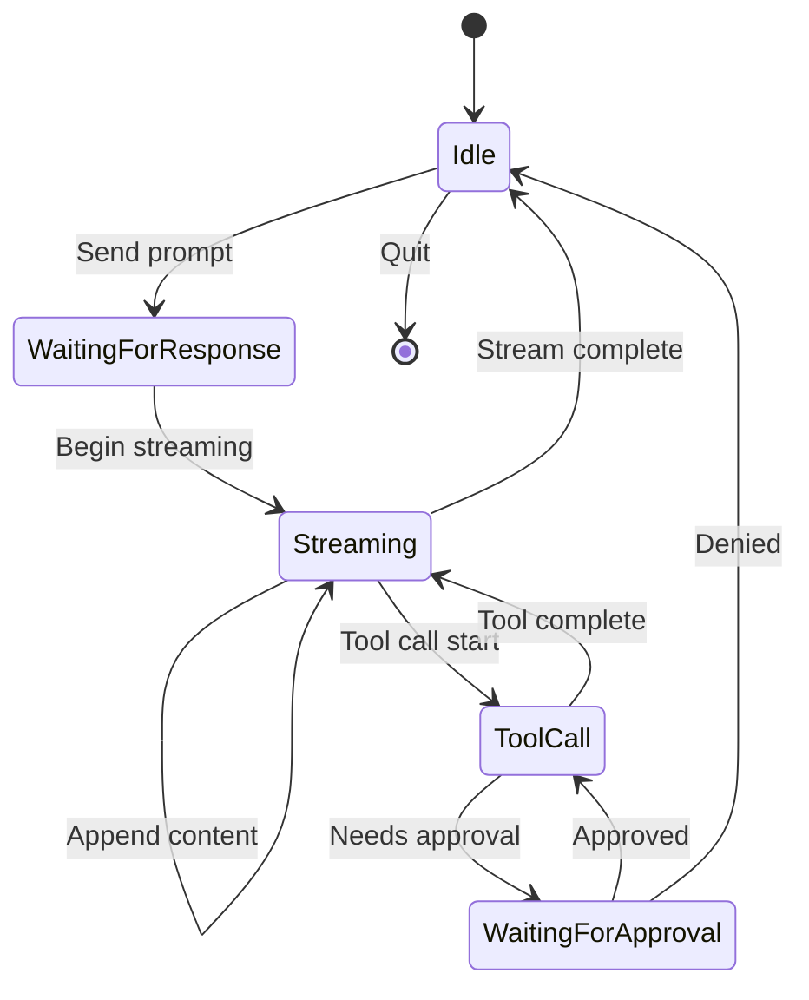
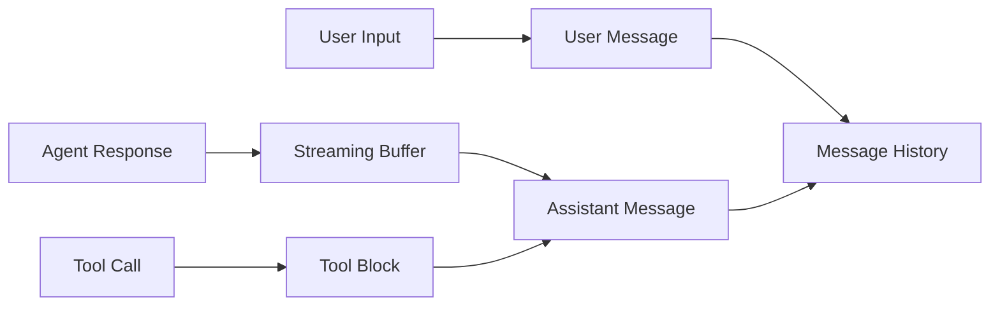
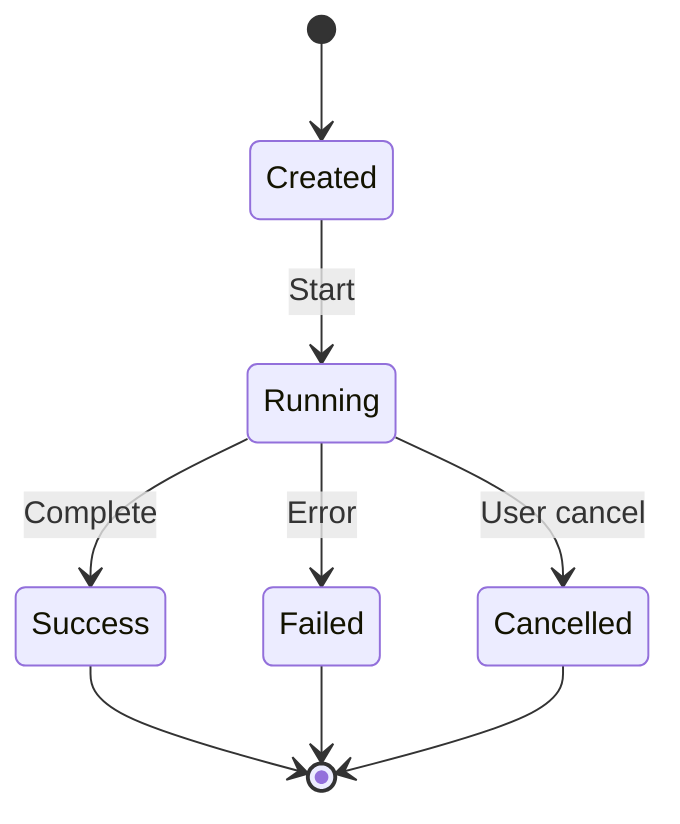
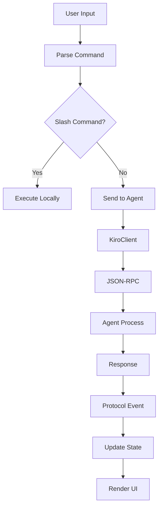
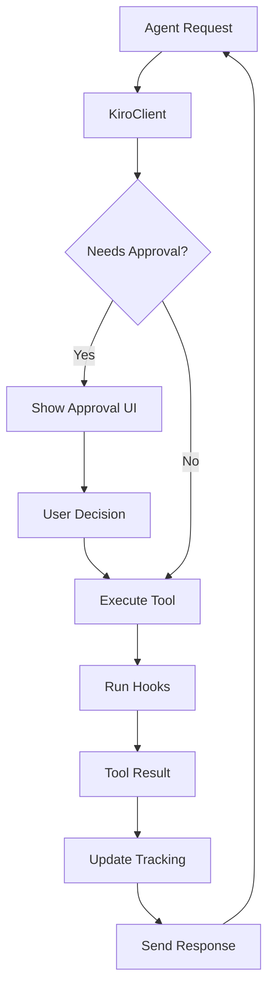
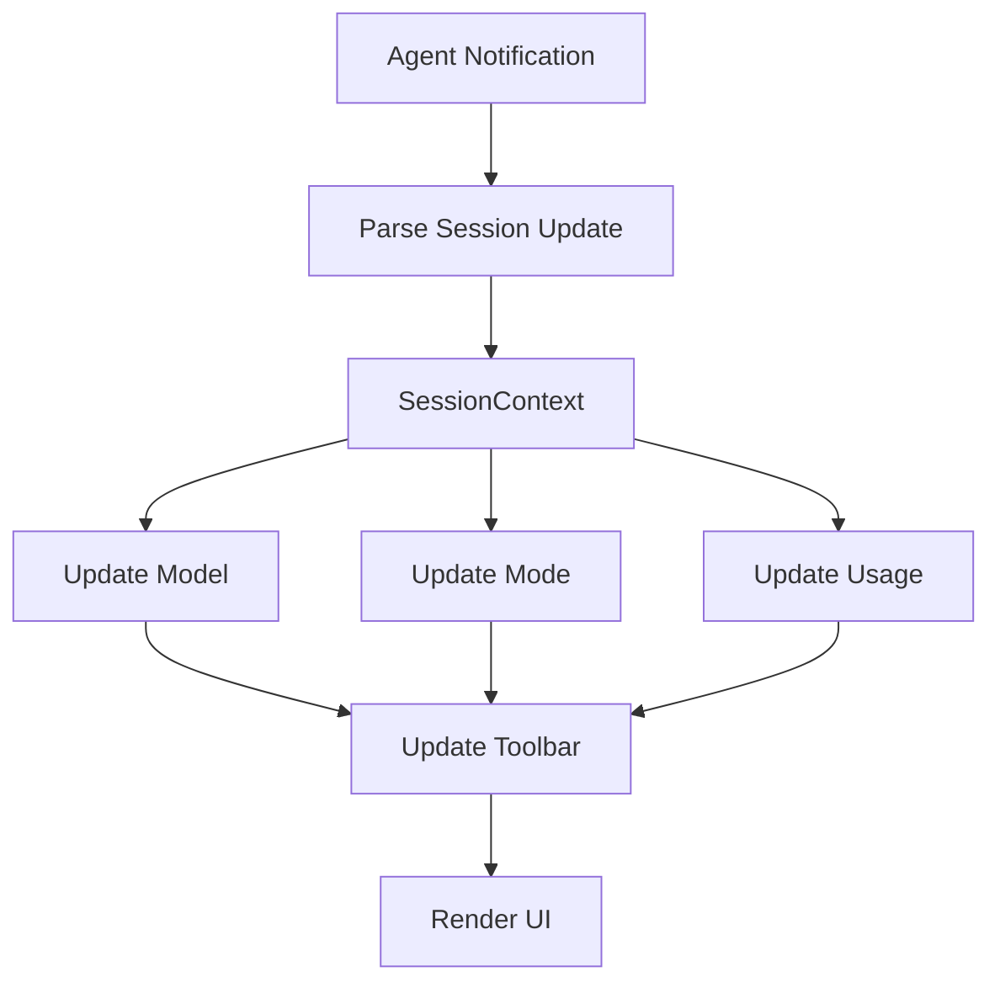

# Data Models

## Overview

This document describes the key data structures, types, and models used throughout Cyril. It covers both the protocol-level data models and internal application state.

## Protocol Data Models

### ACP Message Types

#### JSON-RPC Request
```rust
{
    "jsonrpc": "2.0",
    "id": number | string,
    "method": string,
    "params": object
}
```

#### JSON-RPC Response
```rust
{
    "jsonrpc": "2.0",
    "id": number | string,
    "result": any
}
```

#### JSON-RPC Notification
```rust
{
    "jsonrpc": "2.0",
    "method": string,
    "params": object
}
```

#### JSON-RPC Error
```rust
{
    "jsonrpc": "2.0",
    "id": number | string,
    "error": {
        "code": number,
        "message": string,
        "data": any?
    }
}
```

---

### Permission Request Models

#### File Write Request
```rust
{
    "type": "fileWrite",
    "path": string,
    "content": string,
    "options": ["approve", "deny", "edit"]
}
```

#### Terminal Command Request
```rust
{
    "type": "terminalCommand",
    "command": string,
    "workingDirectory": string?,
    "options": ["approve", "deny"]
}
```

#### Permission Response
```rust
{
    "approved": boolean,
    "selectedOption": string,
    "modifiedContent": string?  // If edited
}
```

---

### Terminal Models

#### Terminal Creation
```rust
// Request
{
    "command": string,
    "workingDirectory": string?
}

// Response
{
    "terminalId": string
}
```

#### Terminal Output
```rust
// Request
{
    "terminalId": string
}

// Response
{
    "output": string,
    "exitCode": number?
}
```

---

### Session Models

#### Session Update
```rust
{
    "sessionId": string,
    "model": string?,
    "contextUsage": number?,  // 0.0 to 1.0
    "modes": [
        {
            "id": string,
            "name": string,
            "description": string?
        }
    ]?
}
```

---

### Extension Models

#### Kiro Commands
```rust
{
    "commands": [
        {
            "name": string,
            "description": string,
            "inputType": "panel" | "selection" | "local",
            "meta": {
                "options": string[]?,
                "placeholder": string?,
                "compact": boolean?
            }?
        }
    ]
}
```

---

## Application State Models

### App State

**Location:** `cyril/src/app.rs`

```rust
pub struct App {
    // Core state
    client: KiroClient,
    session: SessionContext,
    
    // UI component states
    chat: ChatState,
    input: InputState,
    toolbar: ToolbarState,
    approval: Option<ApprovalState>,
    picker: Option<PickerState<String>>,
    
    // Tracking
    tool_calls: HashMap<String, TrackedToolCall>,
    
    // Configuration
    working_dir: PathBuf,
    project_files: Vec<PathBuf>,
    
    // Flags
    should_quit: bool,
    mouse_capture: bool,
}
```

**State Transitions:**


---

### Chat State

**Location:** `cyril/src/ui/chat.rs`

```rust
pub struct ChatState {
    messages: Vec<ChatMessage>,
    streaming_content: String,
    scroll_offset: usize,
    max_messages: usize,
}

pub struct ChatMessage {
    role: Role,
    content: Vec<ContentBlock>,
}

pub enum Role {
    User,
    Assistant,
    System,
}

pub enum ContentBlock {
    Text(String),
    ToolCall {
        id: String,
        name: String,
        status: String,
    },
    Plan {
        title: String,
        steps: Vec<String>,
    },
}
```

**Message Flow:**


---

### Input State

**Location:** `cyril/src/ui/input.rs`

```rust
pub struct InputState {
    textarea: TextArea<'static>,
    command_suggestions: Vec<Suggestion>,
    file_suggestions: Vec<FileSuggestion>,
    active_popup: Option<ActivePopup>,
    selected_index: usize,
}

pub enum ActivePopup {
    Commands,
    Files,
}

pub struct Suggestion {
    display: String,
    value: String,
    description: Option<String>,
}

pub struct FileSuggestion {
    path: PathBuf,
    display: String,
}
```

---

### Tool Call Tracking

**Location:** `cyril/src/ui/tool_calls.rs`

```rust
pub struct TrackedToolCall {
    id: String,
    kind: ToolCallKind,
    status: ToolCallStatus,
    display_label: String,
    primary_path: Option<String>,
    diff_content: Option<String>,
}

pub enum ToolCallKind {
    FileRead,
    FileWrite,
    TerminalCommand,
    Other,
}

pub enum ToolCallStatus {
    Running,
    Success,
    Failed,
    Cancelled,
}

pub struct DiffSummary {
    additions: usize,
    deletions: usize,
    total_lines: usize,
}
```

**Tool Call Lifecycle:**


---

### Approval State

**Location:** `cyril/src/ui/approval.rs`

```rust
pub struct ApprovalState {
    request: serde_json::Value,
    options: Vec<ApprovalOption>,
    selected_index: usize,
}

pub struct ApprovalOption {
    id: String,
    label: String,
    description: Option<String>,
}
```

---

### Picker State

**Location:** `cyril/src/ui/picker.rs`

```rust
pub struct PickerState<T> {
    title: String,
    options: Vec<PickerOption<T>>,
    selected_index: usize,
    scroll_offset: usize,
}

pub struct PickerOption<T> {
    label: String,
    value: T,
    description: Option<String>,
}

pub enum PickerAction<T> {
    Selected(T),
    Cancelled,
}
```

---

### Session Context

**Location:** `cyril-core/src/session.rs`

```rust
pub struct SessionContext {
    session_id: Option<String>,
    current_model: Option<String>,
    optimistic_model: Option<String>,
    available_modes: Vec<AvailableMode>,
    current_mode_id: Option<String>,
    context_usage_pct: f64,
}

pub struct AvailableMode {
    pub id: String,
    pub name: String,
    pub description: Option<String>,
}
```

---

## Platform Models

### Path Translation

**Location:** `cyril-core/src/platform/path.rs`

```rust
pub enum Direction {
    ToNative,  // WSL → Windows
    ToAgent,   // Windows → WSL
}
```

**Path Patterns:**
- Windows: `C:\path\to\file`
- WSL: `/mnt/c/path/to/file`
- Extended: `\\?\C:\path\to\file`
- UNC: `\\server\share\path`

---

### Terminal Models

**Location:** `cyril-core/src/platform/terminal.rs`

```rust
pub struct TerminalManager {
    terminals: HashMap<TerminalId, TerminalProcess>,
    next_id: usize,
}

pub struct TerminalProcess {
    id: TerminalId,
    child: Child,
    output_buffer: String,
    exit_code: Option<i32>,
}

pub struct TerminalId(String);

pub enum Shell {
    Bash,
    Zsh,
    Fish,
    Pwsh,
}
```

---

## Hook Models

### Hook Configuration

**Location:** `cyril-core/src/hooks/config.rs`

```rust
pub struct HooksConfig {
    pub hooks: Vec<ShellHookDef>,
}

pub struct ShellHookDef {
    pub name: String,
    pub event: String,
    pub pattern: Option<String>,
    pub command: String,
}

pub struct ShellHook {
    name: String,
    timing: HookTiming,
    target: HookTarget,
    filter: Option<GlobFilter>,
    command: String,
}

pub struct GlobFilter {
    pattern: glob::Pattern,
}
```

---

### Hook Execution

**Location:** `cyril-core/src/hooks/types.rs`

```rust
pub struct HookRegistry {
    hooks: Vec<Box<dyn Hook>>,
}

pub struct HookContext {
    pub path: Option<String>,
    pub content: Option<String>,
    pub command: Option<String>,
}

pub enum HookResult {
    Continue,
    Block(String),
    Feedback(String),
}

pub enum HookTiming {
    Before,
    After,
}

pub enum HookTarget {
    Write,
    Command,
}
```

---

## Command Models

### Command System

**Location:** `cyril/src/commands.rs`

```rust
pub struct CommandExecutor {
    client: KiroClient,
    channels: CommandChannels,
    agent_commands: Vec<AgentCommand>,
    next_hook_feedback: Option<String>,
}

pub struct CommandChannels {
    pub event_tx: mpsc::UnboundedSender<AppEvent>,
    pub interaction_tx: mpsc::UnboundedSender<InteractionRequest>,
}

pub enum ParsedCommand {
    Slash(SlashCommand),
    Agent(AgentCommand, Option<String>),
    Unknown(String),
    None,
}

pub enum SlashCommand {
    Help,
    New,
    Load(Option<String>),
    Clear,
    Quit,
    Model(Option<String>),
    Mode(Option<String>),
}

pub struct AgentCommand {
    pub name: String,
    pub description: String,
    pub input_type: String,
    pub meta: Option<serde_json::Value>,
}

pub enum CommandResult {
    Success,
    Error(String),
    Quit,
}
```

---

## File Completion Models

**Location:** `cyril/src/file_completer.rs`

```rust
pub struct FileCompleter {
    files: Vec<PathBuf>,
    loaded: bool,
}

pub struct FileSuggestion {
    pub path: PathBuf,
    pub display: String,
}

pub struct AtContext {
    pub trigger_pos: usize,
    pub query: String,
}
```

---

## Extension Models

### Kiro Extensions

**Location:** `cyril-core/src/kiro_ext.rs`

```rust
pub struct KiroExtCommand {
    pub name: String,
    pub description: String,
    pub input_type: String,
    pub meta: Option<KiroCommandMeta>,
}

pub struct KiroCommandMeta {
    pub options: Option<Vec<String>>,
    pub placeholder: Option<String>,
    pub compact: Option<bool>,
}

pub enum KiroCommandsPayload {
    Wrapped { commands: Vec<KiroExtCommand> },
    AcpStyle { commands: Vec<KiroExtCommand> },
    BareArray(Vec<KiroExtCommand>),
}
```

---

## Event Models

### Application Events

**Location:** `cyril-core/src/event.rs`

```rust
pub enum AppEvent {
    Protocol(ProtocolEvent),
    Internal(InternalEvent),
    Extension(ExtensionEvent),
    Interaction(InteractionRequest),
}

pub enum ProtocolEvent {
    StreamingContent(String),
    StreamingComplete,
    ToolCallStart { id: String, name: String },
    ToolCallUpdate { id: String, status: String },
    Error(String),
}

pub enum InternalEvent {
    SessionCreated(String),
    SessionLoaded(String),
    ModelChanged(String),
    ModeChanged(String),
}

pub enum ExtensionEvent {
    CommandsAvailable(Vec<KiroExtCommand>),
    ConfigUpdate(serde_json::Value),
}

pub enum InteractionRequest {
    Approval {
        request: serde_json::Value,
        response_tx: oneshot::Sender<serde_json::Value>,
    },
}
```

---

## UI Models

### Rendering Models

**Location:** `cyril/src/ui/markdown.rs`

```rust
// Internal rendering state
struct RenderState {
    lines: Vec<Line<'static>>,
    current_line: Vec<Span<'static>>,
    style_stack: Vec<Style>,
    in_code_block: bool,
    code_language: Option<String>,
    code_lines: Vec<String>,
}
```

---

### Cache Models

**Location:** `cyril/src/ui/cache.rs`

```rust
pub struct HashCache<K, V> {
    map: HashMap<K, V>,
    order: VecDeque<K>,
    capacity: usize,
}
```

---

## Data Flow Diagrams

### Message Data Flow


### Tool Call Data Flow


### Session Data Flow


---

## Data Validation

### Path Validation
- Must be absolute or relative to working directory
- No path traversal attacks (`..` limited)
- Windows paths validated for format
- WSL paths validated for mount structure

### Command Validation
- Shell commands sanitized
- No shell injection vulnerabilities
- Working directory validated

### JSON Validation
- All ACP messages validated against schema
- Unknown fields ignored
- Required fields enforced

---

## Data Persistence

### Session Persistence
- Session ID stored in memory
- No automatic session saving
- User must explicitly load/save sessions

### Configuration Persistence
- Hooks loaded from `hooks.json`
- No runtime configuration changes persisted
- All configuration file-based

### State Persistence
- No automatic state persistence
- Chat history in memory only
- Tool call tracking in memory only

---

## Memory Management

### Bounded Collections
- Chat messages limited to `max_messages` (default: 100)
- Terminal output capped to prevent memory exhaustion
- File completion cache with LRU eviction

### Resource Cleanup
- Terminal processes released after use
- Completed tool calls can be pruned
- Streaming buffers cleared after completion
