# Data Models

> Generated: 2026-04-11 | Codebase: Cyril

## Core Domain Types (`cyril-core/src/types/`)

### Session Types (`session.rs`)

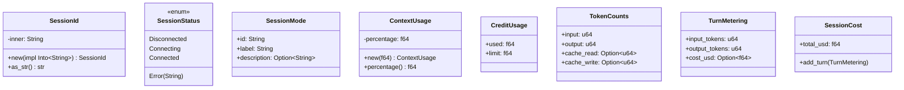

`SessionId` wraps a `String`, implements `Hash + Eq + Clone + Display`. Used as HashMap key for subagent tracking.

### Tool Call Types (`tool_call.rs`)

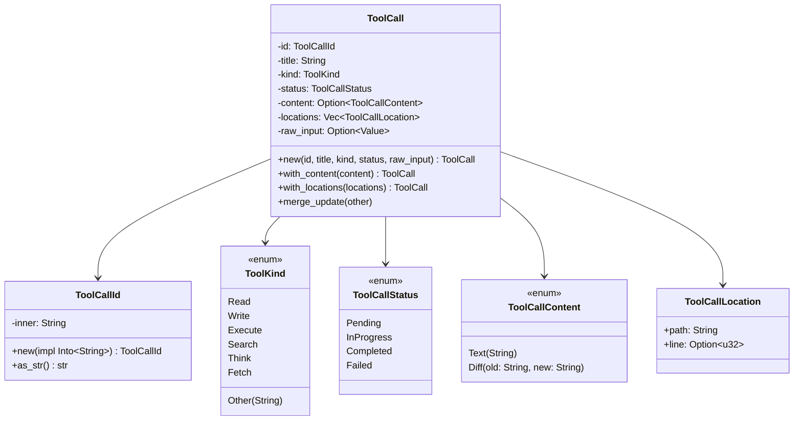

All tool call types are `Send + Sync + Clone`. `ToolCall::merge_update()` applies partial updates (preserves existing fields when update has `None`).

### Event Types (`event.rs`)

See [Interfaces — Notification System](interfaces.md) for the full `Notification` and `BridgeCommand` enums.

Key design decisions:
- `Notification` is `Send + Sync + Clone` — can be freely shared across threads
- `PermissionRequest` is NOT Clone — owns a `oneshot::Sender`
- `RoutedNotification` wraps `Notification` with optional `SessionId` for routing
- `BridgeCommand` is `Send` but not Clone — consumed by the bridge

### Subagent Types (`subagent.rs`)

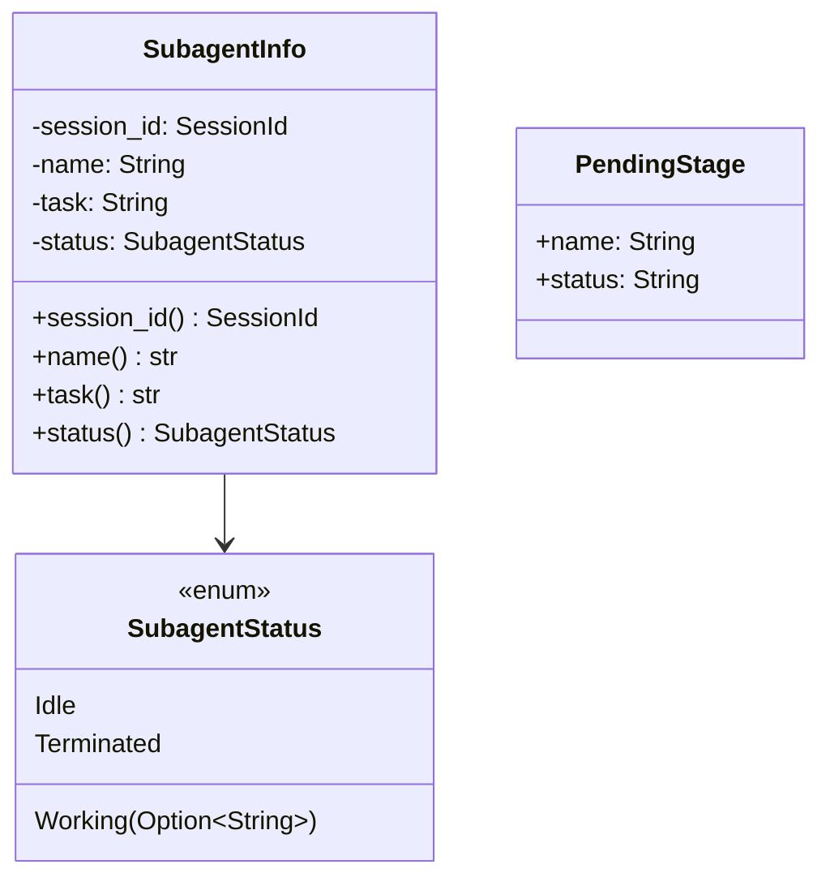

### Command Types (`command.rs`)

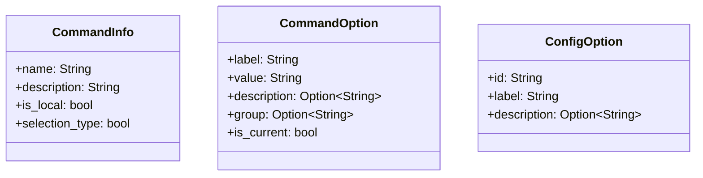

### Message Types (`message.rs`)

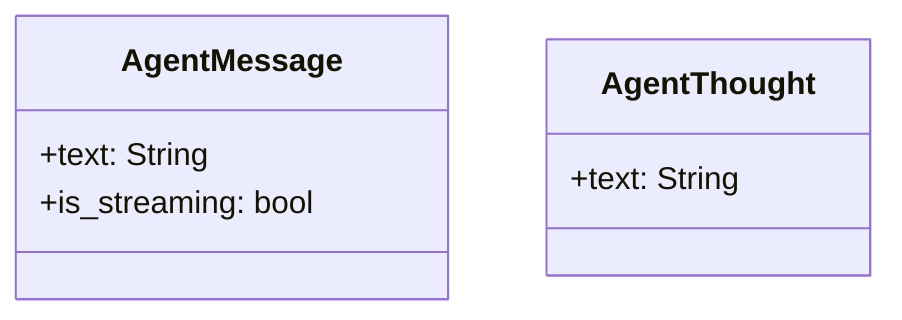

### Plan Types (`plan.rs`)

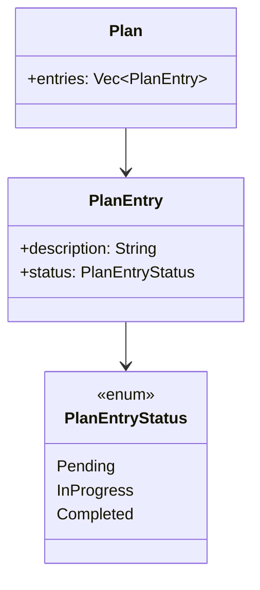

### Hook Types (`hook.rs`)

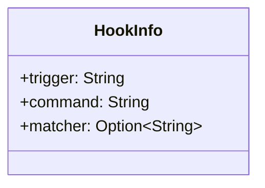

Display-only projection of Kiro's backend `HookConfig`. Trigger values: `PreToolUse`, `PostToolUse`, `UserPromptSubmit`, `Stop`, `AgentSpawn`. Matcher is optional tool name filter.

### Configuration (`config.rs`)

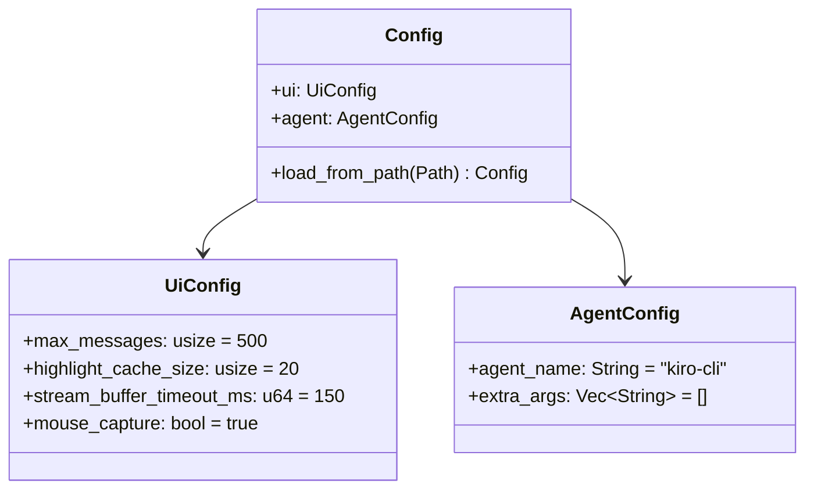

## UI State Types (`cyril-ui/src/traits.rs`)

### Chat Display Types

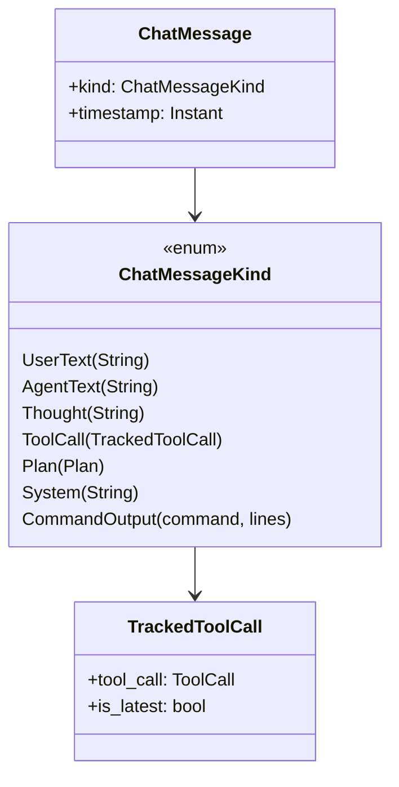

### Overlay State Types

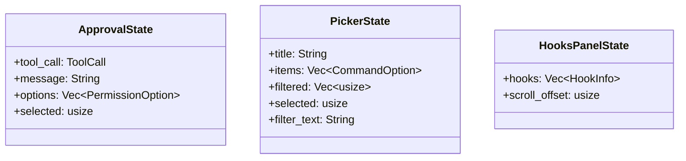

### Autocomplete

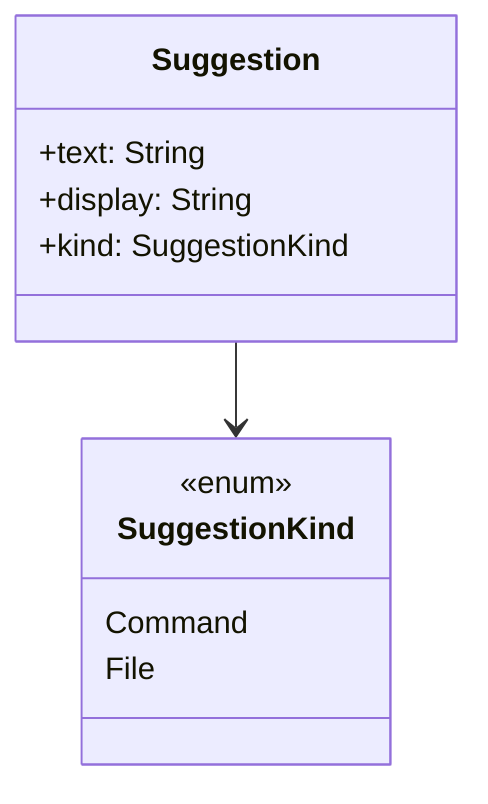

## Subagent UI State (`cyril-ui/src/subagent_ui.rs`)

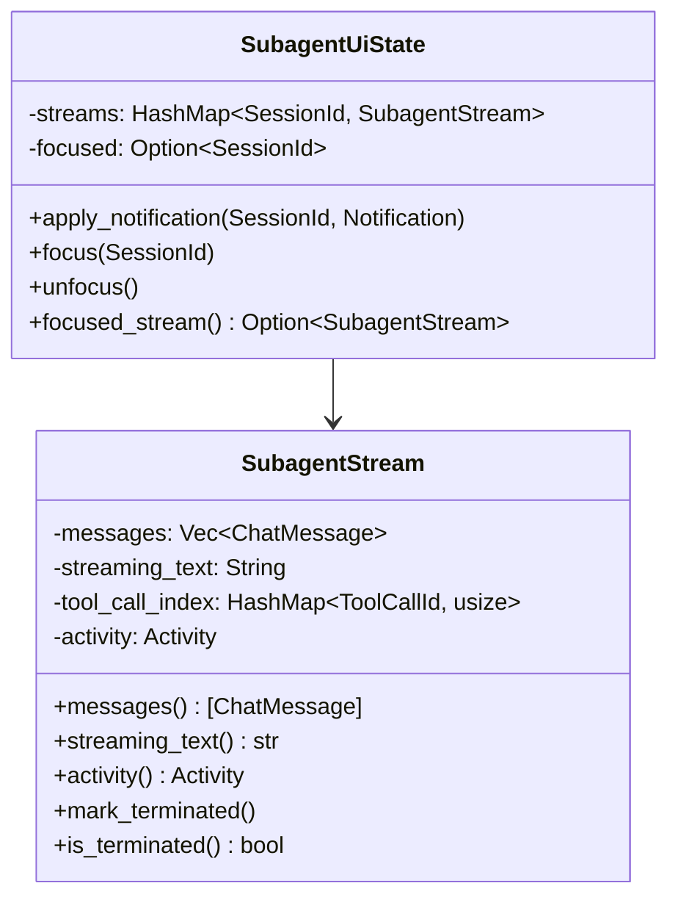
