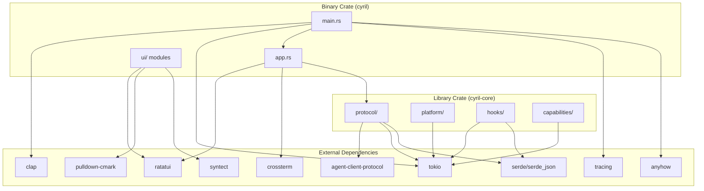

# Dependencies

## Overview

This document catalogs all external dependencies used in Cyril, their purposes, and how they're integrated into the system.

## Dependency Categories

### Protocol & Communication
- **agent-client-protocol** (0.9) - ACP protocol implementation
- **tokio** (1.x) - Async runtime for non-blocking I/O
- **tokio-util** (0.7) - Tokio utilities (compat layer)
- **futures-util** (0.3) - Future combinators and utilities

### Terminal UI
- **ratatui** (0.29) - Terminal UI framework
- **crossterm** (0.28) - Cross-platform terminal manipulation
- **tui-textarea** (0.7) - Text area widget for input

### Text Processing
- **pulldown-cmark** (0.12) - Markdown parser
- **syntect** (5.x) - Syntax highlighting
- **nucleo-matcher** (0.3) - Fuzzy matching for autocomplete
- **similar** (2.x) - Diff computation for file changes

### Serialization & Data
- **serde** (1.x) - Serialization framework
- **serde_json** (1.x) - JSON serialization
- **glob** (0.3) - Glob pattern matching

### CLI & Configuration
- **clap** (4.x) - Command-line argument parsing

### Error Handling
- **anyhow** (1.x) - Flexible error handling
- **thiserror** (2.x) - Derive macro for error types

### Logging
- **tracing** (0.1) - Structured logging
- **tracing-subscriber** (0.3) - Tracing subscriber implementations

### Async Utilities
- **async-trait** (0.1) - Async trait support

### Development Dependencies
- **tempfile** (3.x) - Temporary file creation for tests

---

## Detailed Dependency Analysis

### agent-client-protocol (0.9)

**Purpose:** Core ACP protocol implementation

**Usage:**
- JSON-RPC 2.0 message types
- Protocol method definitions
- Request/response handling

**Integration Points:**
- `cyril-core/src/protocol/client.rs` - Main client implementation
- All ACP method calls

**Why This Version:**
- Latest stable ACP specification
- Required for Kiro CLI compatibility

---

### tokio (1.x)

**Purpose:** Async runtime and I/O primitives

**Features Used:**
- `full` - All features (binary crate)
- `process` - Process spawning
- `sync` - Synchronization primitives
- `rt` - Runtime
- `macros` - Async macros
- `time` - Time utilities
- `io-util` - I/O utilities
- `fs` - File system operations

**Usage:**
- Main async runtime
- Process management for agent
- Terminal process spawning
- File I/O operations
- Channel communication

**Integration Points:**
- `main.rs` - Runtime initialization
- `protocol/transport.rs` - Process spawning
- `platform/terminal.rs` - Terminal management
- `capabilities/fs.rs` - File operations

**Performance Considerations:**
- Multi-threaded runtime for parallelism
- Non-blocking I/O for responsiveness

---

### ratatui (0.29)

**Purpose:** Terminal UI framework

**Features Used:**
- `unstable-rendered-line-info` - Line rendering information

**Usage:**
- Widget rendering
- Layout management
- Style and color support
- Terminal buffer management

**Integration Points:**
- `app.rs` - Main rendering loop
- `ui/` - All UI components
- `tui.rs` - Terminal initialization

**Why This Version:**
- Latest features for line rendering
- Improved performance over older versions

---

### crossterm (0.28)

**Purpose:** Cross-platform terminal manipulation

**Features Used:**
- `event-stream` - Async event handling

**Usage:**
- Keyboard input handling
- Mouse event handling
- Terminal mode switching
- Screen clearing and cursor control

**Integration Points:**
- `app.rs` - Event handling
- `tui.rs` - Terminal setup/restore

**Platform Support:**
- Linux: Native terminal control
- Windows: Windows Console API

---

### pulldown-cmark (0.12)

**Purpose:** Markdown parsing

**Usage:**
- Parse markdown to events
- Support for CommonMark spec
- Inline formatting
- Code blocks
- Lists and headings

**Integration Points:**
- `ui/markdown.rs` - Markdown rendering

**Why This Library:**
- Fast and spec-compliant
- Event-based parsing (streaming friendly)
- Well-maintained

---

### syntect (5.x)

**Purpose:** Syntax highlighting

**Features Used:**
- `default-fancy` - Default syntax definitions and themes

**Usage:**
- Code block highlighting
- Language detection
- Color scheme application

**Integration Points:**
- `ui/highlight.rs` - Syntax highlighting logic
- `ui/markdown.rs` - Code block rendering

**Supported Languages:**
- Rust, Python, JavaScript, TypeScript
- Go, Java, C/C++, C#
- Shell, JSON, YAML, TOML
- Many more via TextMate grammars

**Performance:**
- Lazy loading of syntax definitions
- Caching of highlighters

---

### tui-textarea (0.7)

**Purpose:** Text area widget for input

**Usage:**
- Multi-line text input
- Cursor management
- Text selection
- Undo/redo support

**Integration Points:**
- `ui/input.rs` - Input field implementation

**Why This Library:**
- Purpose-built for ratatui
- Rich editing features
- Good keyboard handling

---

### clap (4.x)

**Purpose:** Command-line argument parsing

**Features Used:**
- `derive` - Derive macro for CLI definition

**Usage:**
- Parse command-line arguments
- Generate help text
- Validate arguments

**Integration Points:**
- `main.rs` - CLI definition

**Arguments Supported:**
- `-d, --directory` - Working directory
- `--prompt` - One-shot prompt
- `--help` - Help text
- `--version` - Version information

---

### nucleo-matcher (0.3)

**Purpose:** Fuzzy matching for autocomplete

**Usage:**
- Fuzzy match file paths
- Fuzzy match commands
- Score and rank matches

**Integration Points:**
- `file_completer.rs` - File completion
- `commands.rs` - Command completion

**Algorithm:**
- Fast fuzzy matching
- Configurable scoring
- Case-insensitive matching

---

### similar (2.x)

**Purpose:** Diff computation

**Usage:**
- Compute file diffs for tool calls
- Line-by-line comparison
- Addition/deletion tracking

**Integration Points:**
- `ui/tool_calls.rs` - Diff visualization

**Features:**
- Unified diff format
- Efficient algorithm
- Customizable output

---

### serde & serde_json (1.x)

**Purpose:** Serialization and JSON handling

**Features Used:**
- `derive` - Derive macros for Serialize/Deserialize

**Usage:**
- JSON-RPC message serialization
- Configuration file parsing
- ACP payload handling
- Hook configuration

**Integration Points:**
- `protocol/client.rs` - ACP messages
- `hooks/config.rs` - Hook configuration
- `kiro_ext.rs` - Extension payloads
- Throughout codebase for JSON handling

---

### glob (0.3)

**Purpose:** Glob pattern matching

**Usage:**
- Hook pattern matching
- File filtering

**Integration Points:**
- `hooks/config.rs` - Hook glob filters

**Pattern Support:**
- `*` - Match any characters
- `**` - Match directories recursively
- `?` - Match single character
- `[...]` - Character classes

---

### anyhow (1.x)

**Purpose:** Flexible error handling

**Usage:**
- Error propagation with `?`
- Context addition to errors
- Dynamic error types

**Integration Points:**
- Throughout codebase for error handling
- Main error type for most functions

**Why This Library:**
- Ergonomic error handling
- Good error messages
- No boilerplate

---

### thiserror (2.x)

**Purpose:** Derive macro for error types

**Usage:**
- Define custom error types
- Automatic Display implementation
- Error source chaining

**Integration Points:**
- `cyril-core` - Custom error types
- Platform-specific errors

---

### tracing & tracing-subscriber (0.1, 0.3)

**Purpose:** Structured logging and diagnostics

**Usage:**
- Debug logging
- Error tracking
- Performance tracing
- Event correlation

**Integration Points:**
- Throughout codebase for logging
- `main.rs` - Subscriber initialization

**Log Levels:**
- ERROR - Critical errors
- WARN - Warnings
- INFO - Informational messages
- DEBUG - Debug information
- TRACE - Detailed tracing

**Output:**
- File: `cyril.log`
- Format: Structured JSON or text

---

### async-trait (0.1)

**Purpose:** Async trait support

**Usage:**
- Define async trait methods
- Hook trait with async execution

**Integration Points:**
- `hooks/types.rs` - Hook trait

**Why Needed:**
- Rust doesn't natively support async in traits
- Provides macro for async trait methods

---

### tokio-util (0.7)

**Purpose:** Tokio utilities

**Features Used:**
- `compat` - Compatibility layer for futures

**Usage:**
- Bridge between different async types
- Compatibility with older async code

**Integration Points:**
- `protocol/transport.rs` - Process I/O

---

### tempfile (3.x) [dev-dependency]

**Purpose:** Temporary file creation for tests

**Usage:**
- Create temporary files in tests
- Automatic cleanup
- Unique file names

**Integration Points:**
- Test modules throughout codebase

---

## Dependency Graph

---

## Version Constraints

### Semantic Versioning
- **Major version (1.x):** Breaking changes allowed
- **Minor version (1.2.x):** New features, no breaking changes
- **Patch version (1.2.3):** Bug fixes only

### Update Strategy
- **Patch updates:** Safe to update automatically
- **Minor updates:** Review changelog, test thoroughly
- **Major updates:** Requires code changes, careful migration

---

## Security Considerations

### Dependency Auditing
- Regular `cargo audit` runs
- Monitor security advisories
- Update vulnerable dependencies promptly

### Supply Chain Security
- All dependencies from crates.io
- Verify checksums via Cargo.lock
- Review dependency tree for suspicious packages

---

## Build Dependencies

### Rust Toolchain
- **Minimum Rust Version:** 1.70+ (Edition 2021)
- **Recommended:** Latest stable

### System Dependencies
- **Linux:** None (statically linked)
- **Windows:** None (statically linked)

---

## Optional Dependencies

Currently, Cyril has no optional dependencies. All features are enabled by default.

---

## Future Dependency Considerations

### Potential Additions
- **notify** - File system watching for live reload
- **reqwest** - HTTP client for remote features
- **rusqlite** - Local database for session persistence

### Potential Removals
- None identified at this time

---

## Dependency Maintenance

### Update Frequency
- **Monthly:** Check for updates
- **Quarterly:** Major dependency updates
- **As needed:** Security patches

### Testing After Updates
1. Run full test suite
2. Manual testing of key workflows
3. Check for deprecation warnings
4. Review changelog for breaking changes

---

## License Compatibility

All dependencies use permissive licenses compatible with MIT:
- MIT License
- Apache 2.0 License
- BSD Licenses

No GPL or copyleft licenses in dependency tree.
