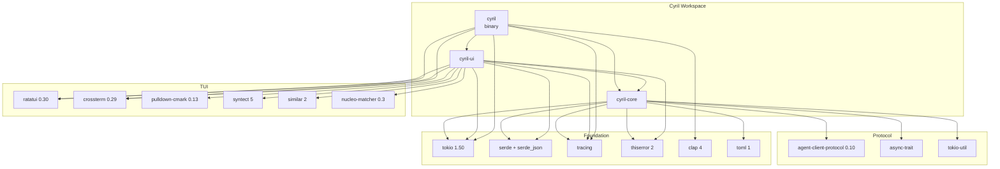

# Dependencies

> Generated: 2026-04-11 | Codebase: Cyril

## Workspace Dependencies

All versions are centralized in the root `Cargo.toml` `[workspace.dependencies]` section.

### Runtime Dependencies

| Crate | Version | Used By | Purpose |
|-------|---------|---------|---------|
| `agent-client-protocol` | 0.10 | cyril-core | ACP Client trait, transport, JSON-RPC protocol |
| `tokio` | 1.50 | all | Async runtime (full features in binary, selective in libs) |
| `ratatui` | 0.30 | cyril, cyril-ui | TUI framework (with `unstable-rendered-line-info`) |
| `crossterm` | 0.29 | cyril, cyril-ui | Terminal I/O, event stream, mouse capture |
| `serde` | 1 | cyril-core | Serialization (with `derive` feature) |
| `serde_json` | 1 | all | JSON parsing/generation |
| `thiserror` | 2 | cyril-core, cyril-ui | Error derive macros |
| `tracing` | 0.1 | all | Structured logging |
| `anyhow` | 1 | (dev) | Error handling in tests |
| `clap` | 4 | cyril | CLI argument parsing (with `derive`) |
| `tracing-subscriber` | 0.3 | cyril | Log subscriber (JSON format to file) |
| `async-trait` | 0.1 | cyril-core | Async trait support (for `!Send` ACP Client) |
| `tokio-util` | 0.7 | cyril-core | Compat layer for ACP transport |
| `futures-util` | 0.3 | cyril, cyril-core | Stream utilities (`FutureExt`, `StreamExt`) |
| `pulldown-cmark` | 0.13 | cyril-ui | Markdown parsing (no default features) |
| `syntect` | 5 | cyril-ui | Syntax highlighting (`default-fancy` features) |
| `similar` | 2 | cyril-ui | Diff computation for tool call content |
| `nucleo-matcher` | 0.3 | cyril-ui | Fuzzy matching for picker filtering |
| `toml` | 1 | cyril-core | Config file parsing |

### Dev Dependencies

| Crate | Version | Used By | Purpose |
|-------|---------|---------|---------|
| `rstest` | 0.25 | cyril-core, cyril-ui | Parameterized test fixtures |
| `insta` | 1.42 | cyril-ui | Snapshot testing |
| `tempfile` | 3 | cyril-core, cyril-ui | Temporary directories in tests |

## Dependency Graph

## Key Dependency Notes

### `agent-client-protocol` (0.10)
The ACP crate provides:
- `Client` trait — async trait (`!Send`) that `KiroClient` implements
- `SessionNotification`, `ExtNotification`, `RequestPermissionRequest` — protocol message types
- Transport layer — JSON-RPC 2.0 over stdio
- `Error` type — protocol-level errors

This is the most critical external dependency. Version changes may require updates to `convert.rs`.

### `ratatui` (0.30)
Uses the `unstable-rendered-line-info` feature for accurate scroll calculations. The `TestBackend` is used extensively in widget tests.

### `crossterm` (0.29)
Configured with `event-stream` feature (no default features). Provides `EventStream` for async terminal event reading and mouse capture control.

### `syntect` (5)
Uses `default-fancy` features for syntax highlighting. Integrated via `cyril-ui/src/highlight.rs` with LRU caching.

### `tokio` Feature Configuration
- `cyril` (binary): `features = ["full"]`
- `cyril-core`: `features = ["sync", "rt", "macros", "time", "process"]`
- `cyril-ui`: `features = ["sync", "process"]`
- `cyril-core` (dev): `features = ["full", "test-util"]`

## External Runtime Dependencies

| Dependency | Required | Purpose |
|-----------|----------|---------|
| `kiro-cli` | Yes | Agent process (spawned as subprocess) |
| WSL | Windows only | Hosts `kiro-cli` on Windows |
| Rust 1.94.0+ | Build only | Minimum supported Rust version |
