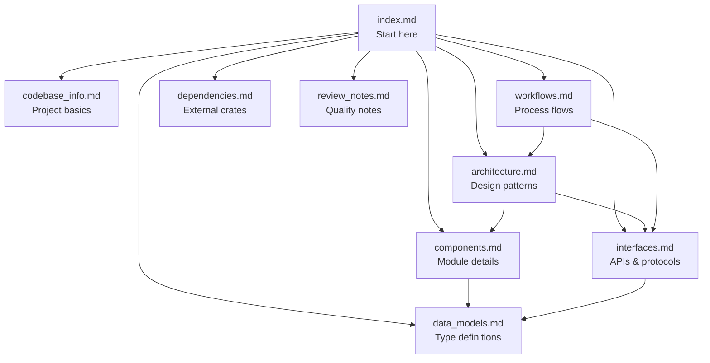

# Cyril Documentation Index

> **For AI Assistants:** This file is your primary entry point. Read this first to understand what documentation is available and which file to consult for specific questions. Each file summary below contains enough context to determine relevance without reading the full file.

> Generated: 2026-04-11 | Codebase: Cyril — Cross-platform TUI client for Kiro CLI via ACP

## Quick Context

Cyril is a Rust TUI application (three-crate workspace) that communicates with `kiro-cli` over the Agent Client Protocol (ACP). It provides streaming markdown rendering, tool call visibility, approval workflows, and multi-session subagent management.

**Workspace:** `cyril` (binary) + `cyril-core` (protocol/types) + `cyril-ui` (state/rendering)

## Documentation Files

### [codebase_info.md](codebase_info.md)
**What:** Project identity, workspace structure, build configuration, user config options.
**When to consult:** Questions about project setup, build profiles, configuration options, workspace layout, Rust edition/version.
**Key content:** Three-crate workspace, Edition 2024, Rust 1.94.0, TOML config at `~/.config/cyril/config.toml`.

### [architecture.md](architecture.md)
**What:** System architecture, core design patterns, crate dependency graph, event loop structure.
**When to consult:** Questions about how components connect, the bridge pattern, notification routing, state/renderer separation, command registry pattern, why code is organized a certain way.
**Key content:** Bridge channel architecture (BridgeHandle/BridgeSender), RoutedNotification routing (global vs scoped), TuiState trait for renderer isolation, CommandRegistry with trait-based commands, adaptive frame rate.

### [components.md](components.md)
**What:** Detailed documentation of every module in all three crates.
**When to consult:** Questions about what a specific file does, what methods a component has, where to find specific functionality, how to add new features.
**Key content:** Per-file descriptions for all 48 source files across cyril, cyril-core, and cyril-ui. Includes key methods, responsibilities, and relationships.

### [interfaces.md](interfaces.md)
**What:** APIs, protocol interfaces, internal trait definitions, Kiro extension methods.
**When to consult:** Questions about the ACP protocol, how components communicate, what messages flow between systems, the Command trait, TuiState trait, permission flow, Kiro extension notification methods.
**Key content:** ACP Client trait implementation, BridgeCommand/Notification enums, Command trait + CommandResult, TuiState trait, full table of `kiro.dev/*` extension methods.

### [data_models.md](data_models.md)
**What:** All data structures and type definitions with Mermaid class diagrams.
**When to consult:** Questions about type definitions, struct fields, enum variants, how data is structured, what fields a type has.
**Key content:** SessionId, ToolCall (with merge semantics), Notification variants, SubagentInfo, CommandInfo, Config, ChatMessage/ChatMessageKind, overlay state types, SubagentStream.

### [workflows.md](workflows.md)
**What:** Process flows and sequence diagrams for all major operations.
**When to consult:** Questions about how a feature works end-to-end, what happens when a user does X, the order of operations, lifecycle of tool calls/subagents/commands.
**Key content:** Startup sequence, event loop priority, user input → agent response flow, tool call lifecycle, subagent lifecycle, command execution (direct + selection-type), rendering pipeline, adaptive frame rate states, path translation.

### [dependencies.md](dependencies.md)
**What:** External dependencies, version info, feature configurations, dependency graph.
**When to consult:** Questions about what crates are used, why a dependency exists, version constraints, tokio feature flags, build dependencies.
**Key content:** Full dependency table with versions and purposes, per-crate tokio feature configuration, `agent-client-protocol` as critical dependency, runtime requirements.

### [review_notes.md](review_notes.md)
**What:** Documentation quality assessment, identified gaps, recommendations.
**When to consult:** Understanding documentation limitations, known gaps, areas needing more detail.

## File Relationships

## Common Query Routing

| Question Type | Primary File | Secondary |
|--------------|-------------|-----------|
| "How does X work?" | workflows.md | architecture.md |
| "Where is X implemented?" | components.md | — |
| "What type/struct is X?" | data_models.md | interfaces.md |
| "How do components communicate?" | interfaces.md | architecture.md |
| "What dependencies does X use?" | dependencies.md | — |
| "How to add a new widget?" | components.md (cyril-ui widgets) | workflows.md (rendering) |
| "How to add a new command?" | components.md (commands/) | interfaces.md (Command trait) |
| "How does the bridge work?" | architecture.md (bridge pattern) | interfaces.md (channels) |
| "How are notifications routed?" | architecture.md (routing) | workflows.md (event loop) |
| "What config options exist?" | codebase_info.md | data_models.md (Config) |
