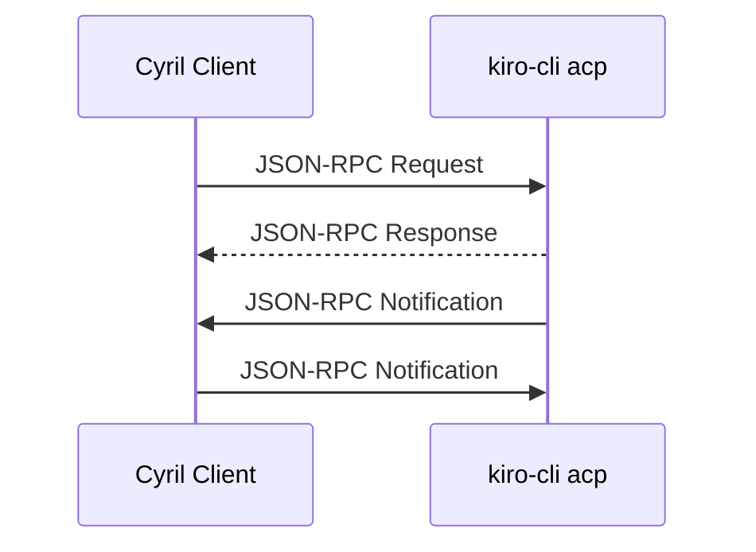
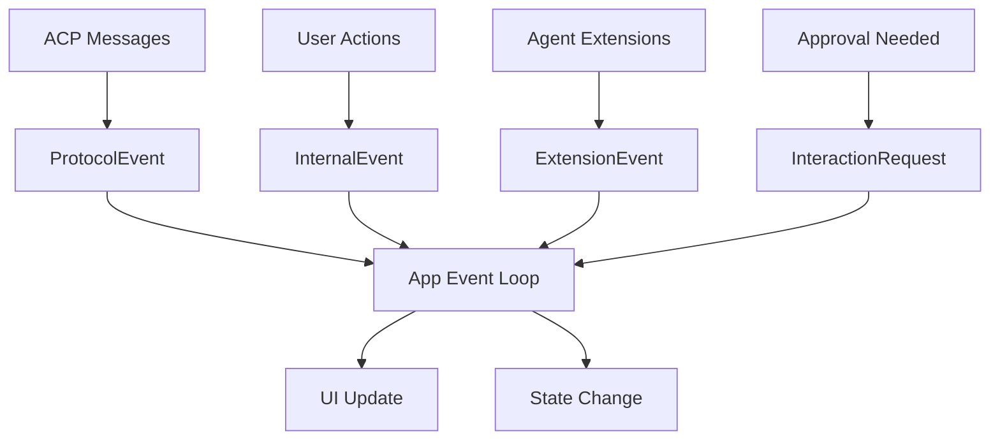

# Interfaces and APIs

## Overview

This document describes the key interfaces, APIs, and integration points in Cyril. It covers the Agent Client Protocol (ACP) implementation, internal module interfaces, and extension points.

## Agent Client Protocol (ACP) Interface

### Protocol Overview

Cyril implements the Agent Client Protocol (ACP) version 0.9, which uses JSON-RPC 2.0 over stdio for communication between the client and agent.

**Transport:** stdin/stdout  
**Format:** JSON-RPC 2.0  
**Direction:** Bidirectional



### Implemented ACP Methods

#### Client → Agent Methods

##### acp/requestPermission
Request user approval for an action.

**Request:**
```json
{
  "jsonrpc": "2.0",
  "id": 1,
  "method": "acp/requestPermission",
  "params": {
    "request": {
      "type": "fileWrite",
      "path": "/path/to/file.rs",
      "content": "...",
      "options": ["approve", "deny", "edit"]
    }
  }
}
```

**Response:**
```json
{
  "jsonrpc": "2.0",
  "id": 1,
  "result": {
    "approved": true,
    "selectedOption": "approve"
  }
}
```

---

##### acp/readTextFile
Read a text file from the file system.

**Request:**
```json
{
  "jsonrpc": "2.0",
  "id": 2,
  "method": "acp/readTextFile",
  "params": {
    "path": "/path/to/file.txt"
  }
}
```

**Response:**
```json
{
  "jsonrpc": "2.0",
  "id": 2,
  "result": {
    "content": "file contents here"
  }
}
```

---

##### acp/writeTextFile
Write a text file to the file system.

**Request:**
```json
{
  "jsonrpc": "2.0",
  "id": 3,
  "method": "acp/writeTextFile",
  "params": {
    "path": "/path/to/file.txt",
    "content": "new content"
  }
}
```

**Response:**
```json
{
  "jsonrpc": "2.0",
  "id": 3,
  "result": {}
}
```

---

##### acp/createTerminal
Create a new terminal process.

**Request:**
```json
{
  "jsonrpc": "2.0",
  "id": 4,
  "method": "acp/createTerminal",
  "params": {
    "command": "cargo test",
    "workingDirectory": "/path/to/project"
  }
}
```

**Response:**
```json
{
  "jsonrpc": "2.0",
  "id": 4,
  "result": {
    "terminalId": "term-123"
  }
}
```

---

##### acp/terminalOutput
Get output from a terminal process.

**Request:**
```json
{
  "jsonrpc": "2.0",
  "id": 5,
  "method": "acp/terminalOutput",
  "params": {
    "terminalId": "term-123"
  }
}
```

**Response:**
```json
{
  "jsonrpc": "2.0",
  "id": 5,
  "result": {
    "output": "test output...",
    "exitCode": 0
  }
}
```

---

##### acp/waitForTerminalExit
Wait for a terminal process to complete.

**Request:**
```json
{
  "jsonrpc": "2.0",
  "id": 6,
  "method": "acp/waitForTerminalExit",
  "params": {
    "terminalId": "term-123"
  }
}
```

**Response:**
```json
{
  "jsonrpc": "2.0",
  "id": 6,
  "result": {
    "exitCode": 0
  }
}
```

---

##### acp/releaseTerminal
Release a terminal process (cleanup).

**Request:**
```json
{
  "jsonrpc": "2.0",
  "id": 7,
  "method": "acp/releaseTerminal",
  "params": {
    "terminalId": "term-123"
  }
}
```

**Response:**
```json
{
  "jsonrpc": "2.0",
  "id": 7,
  "result": {}
}
```

---

##### acp/killTerminal
Force terminate a terminal process.

**Request:**
```json
{
  "jsonrpc": "2.0",
  "id": 8,
  "method": "acp/killTerminal",
  "params": {
    "terminalId": "term-123"
  }
}
```

**Response:**
```json
{
  "jsonrpc": "2.0",
  "id": 8,
  "result": {}
}
```

---

#### Agent → Client Notifications

##### acp/sessionUpdate
Agent notifies client of session changes.

**Notification:**
```json
{
  "jsonrpc": "2.0",
  "method": "acp/sessionUpdate",
  "params": {
    "sessionId": "session-abc123",
    "model": "claude-3.5-sonnet",
    "contextUsage": 0.45
  }
}
```

---

##### kiro/ext/commands
Kiro-specific extension for available commands.

**Notification:**
```json
{
  "jsonrpc": "2.0",
  "method": "kiro/ext/commands",
  "params": {
    "commands": [
      {
        "name": "model",
        "description": "Change the active model",
        "inputType": "selection",
        "meta": {
          "options": ["claude-3.5-sonnet", "gpt-4"]
        }
      }
    ]
  }
}
```

---

## Internal Module Interfaces

### KiroClient Interface

**Location:** `cyril-core/src/protocol/client.rs`

**Public API:**
```rust
pub struct KiroClient {
    // Internal fields
}

impl KiroClient {
    /// Create a new ACP client
    pub fn new(
        stdin: ChildStdin,
        stdout: BufReader<ChildStdout>,
    ) -> Self;
    
    /// Send an ACP request
    pub async fn emit(
        &mut self,
        method: &str,
        params: serde_json::Value,
    ) -> Result<serde_json::Value>;
    
    /// Request user permission
    pub async fn request_permission(
        &mut self,
        request: serde_json::Value,
    ) -> Result<serde_json::Value>;
    
    /// Read a text file
    pub async fn read_text_file(
        &mut self,
        path: &str,
    ) -> Result<String>;
    
    /// Write a text file
    pub async fn write_text_file(
        &mut self,
        path: &str,
        content: &str,
    ) -> Result<()>;
    
    /// Create a terminal process
    pub async fn create_terminal(
        &mut self,
        command: &str,
        working_directory: Option<&str>,
    ) -> Result<String>;
    
    /// Get terminal output
    pub async fn terminal_output(
        &mut self,
        terminal_id: &str,
    ) -> Result<(String, Option<i32>)>;
    
    /// Wait for terminal to exit
    pub async fn wait_for_terminal_exit(
        &mut self,
        terminal_id: &str,
    ) -> Result<i32>;
    
    /// Release terminal resources
    pub async fn release_terminal(
        &mut self,
        terminal_id: &str,
    ) -> Result<()>;
    
    /// Kill terminal process
    pub async fn kill_terminal(
        &mut self,
        terminal_id: &str,
    ) -> Result<()>;
    
    /// Send session notification
    pub async fn session_notification(
        &mut self,
        params: serde_json::Value,
    ) -> Result<()>;
    
    /// Send extension notification
    pub async fn ext_notification(
        &mut self,
        method: &str,
        params: serde_json::Value,
    ) -> Result<()>;
}
```

---

### AgentProcess Interface

**Location:** `cyril-core/src/protocol/transport.rs`

**Public API:**
```rust
pub struct AgentProcess {
    // Internal fields
}

impl AgentProcess {
    /// Spawn a new agent process
    pub fn spawn(
        command: &str,
        args: &[&str],
        working_dir: Option<&Path>,
    ) -> Result<Self>;
    
    /// Take ownership of stdin
    pub fn take_stdin(&mut self) -> Option<ChildStdin>;
    
    /// Take ownership of stdout
    pub fn take_stdout(&mut self) -> Option<ChildStdout>;
    
    /// Drain stderr output
    pub async fn drain_stderr(&mut self) -> String;
    
    /// Check if process is still running
    pub fn try_wait(&mut self) -> Result<Option<ExitStatus>>;
    
    /// Check startup success
    pub async fn check_startup(&mut self) -> Result<()>;
}
```

---

### Path Translation Interface

**Location:** `cyril-core/src/platform/path.rs`

**Public API:**
```rust
pub enum Direction {
    ToNative,  // WSL → Windows
    ToAgent,   // Windows → WSL
}

/// Convert Windows path to WSL path
pub fn win_to_wsl(path: &str) -> String;

/// Convert WSL path to Windows path
pub fn wsl_to_win(path: &str) -> String;

/// Translate paths in JSON payload
pub fn translate_paths_in_json(
    value: &mut serde_json::Value,
    direction: Direction,
);

/// Check if path looks like Windows path
pub fn looks_like_windows_path(s: &str) -> bool;

/// Check if path looks like WSL mount path
pub fn looks_like_wsl_mount_path(s: &str) -> bool;
```

**Usage Example:**
```rust
use cyril_core::platform::path::{win_to_wsl, Direction, translate_paths_in_json};

// Simple path translation
let wsl_path = win_to_wsl(r"C:\Users\name\project");
// Result: "/mnt/c/Users/name/project"

// JSON payload translation
let mut payload = json!({
    "path": r"C:\Users\name\file.txt",
    "workingDirectory": r"C:\Users\name"
});
translate_paths_in_json(&mut payload, Direction::ToAgent);
// Paths are now WSL format
```

---

### Terminal Manager Interface

**Location:** `cyril-core/src/platform/terminal.rs`

**Public API:**
```rust
pub struct TerminalManager {
    // Internal fields
}

pub struct TerminalId(String);

pub enum Shell {
    Bash,
    Zsh,
    Fish,
    Pwsh,
}

impl TerminalManager {
    /// Create a new terminal manager
    pub fn new() -> Self;
    
    /// Create a terminal process
    pub async fn create_terminal(
        &mut self,
        command: &str,
        working_directory: Option<&Path>,
    ) -> Result<TerminalId>;
    
    /// Get terminal output
    pub async fn get_output(
        &mut self,
        id: &TerminalId,
    ) -> Result<(String, Option<i32>)>;
    
    /// Wait for terminal to exit
    pub async fn wait_for_exit(
        &mut self,
        id: &TerminalId,
    ) -> Result<i32>;
    
    /// Release terminal resources
    pub async fn release(
        &mut self,
        id: &TerminalId,
    ) -> Result<()>;
    
    /// Kill terminal process
    pub async fn kill(
        &mut self,
        id: &TerminalId,
    ) -> Result<()>;
}

impl Shell {
    /// Detect available shell
    pub fn detect_shell() -> Self;
    
    /// Get shell program name
    pub fn program(&self) -> &str;
    
    /// Get command flag (-c, etc.)
    pub fn command_flag(&self) -> &str;
}
```

---

### Hook System Interface

**Location:** `cyril-core/src/hooks/`

**Public API:**
```rust
// types.rs
pub struct HookRegistry {
    // Internal fields
}

pub enum HookTiming {
    Before,
    After,
}

pub enum HookTarget {
    Write,
    Command,
}

pub struct HookContext {
    pub path: Option<String>,
    pub content: Option<String>,
    pub command: Option<String>,
}

pub enum HookResult {
    Continue,
    Block(String),
    Feedback(String),
}

pub trait Hook: Send + Sync {
    fn name(&self) -> &str;
    fn timing(&self) -> HookTiming;
    fn target(&self) -> HookTarget;
    async fn run(&self, ctx: &HookContext) -> HookResult;
}

impl HookRegistry {
    /// Create a new hook registry
    pub fn new() -> Self;
    
    /// Register a hook
    pub fn register(&mut self, hook: Box<dyn Hook>);
    
    /// Run before hooks
    pub async fn run_before(
        &self,
        target: HookTarget,
        ctx: &HookContext,
    ) -> Result<(), String>;
    
    /// Run after hooks
    pub async fn run_after(
        &self,
        target: HookTarget,
        ctx: &HookContext,
    ) -> Vec<String>;
}

// config.rs
pub struct HooksConfig {
    pub hooks: Vec<ShellHookDef>,
}

pub struct ShellHookDef {
    pub name: String,
    pub event: String,
    pub pattern: Option<String>,
    pub command: String,
}

/// Load hooks from hooks.json
pub async fn load_hooks_config(
    path: &Path,
) -> Result<HooksConfig>;
```

**Hook Configuration Format:**
```json
{
  "hooks": [
    {
      "name": "Format Rust files",
      "event": "afterWrite",
      "pattern": "*.rs",
      "command": "rustfmt {{file}}"
    },
    {
      "name": "Run tests",
      "event": "afterWrite",
      "pattern": "src/**/*.rs",
      "command": "cargo test"
    }
  ]
}
```

---

### Session Context Interface

**Location:** `cyril-core/src/session.rs`

**Public API:**
```rust
pub struct SessionContext {
    // Internal fields
}

pub struct AvailableMode {
    pub id: String,
    pub name: String,
    pub description: Option<String>,
}

impl SessionContext {
    /// Create a new session context
    pub fn new() -> Self;
    
    /// Set session ID
    pub fn set_session_id(&mut self, id: String);
    
    /// Get current session ID
    pub fn session_id(&self) -> Option<&str>;
    
    /// Set configuration options
    pub fn set_config_options(&mut self, options: serde_json::Value);
    
    /// Set optimistic model (before confirmation)
    pub fn set_optimistic_model(&mut self, model: String);
    
    /// Get current model
    pub fn current_model(&self) -> Option<&str>;
    
    /// Set available modes
    pub fn set_modes(&mut self, modes: Vec<AvailableMode>);
    
    /// Get available modes
    pub fn available_modes(&self) -> &[AvailableMode];
    
    /// Set current mode ID
    pub fn set_current_mode_id(&mut self, id: String);
    
    /// Get current mode ID
    pub fn current_mode_id(&self) -> Option<&str>;
    
    /// Set context usage percentage
    pub fn set_context_usage_pct(&mut self, pct: f64);
    
    /// Get context usage percentage
    pub fn context_usage_pct(&self) -> f64;
}
```

---

## Event System Interface

### Event Types

**Location:** `cyril-core/src/event.rs`

```rust
pub enum AppEvent {
    Protocol(ProtocolEvent),
    Internal(InternalEvent),
    Extension(ExtensionEvent),
    Interaction(InteractionRequest),
}

pub enum ProtocolEvent {
    StreamingContent(String),
    StreamingComplete,
    ToolCallStart { id: String, name: String },
    ToolCallUpdate { id: String, status: String },
    Error(String),
}

pub enum InternalEvent {
    SessionCreated(String),
    SessionLoaded(String),
    ModelChanged(String),
    ModeChanged(String),
}

pub enum ExtensionEvent {
    CommandsAvailable(Vec<KiroExtCommand>),
    ConfigUpdate(serde_json::Value),
}

pub enum InteractionRequest {
    Approval {
        request: serde_json::Value,
        response_tx: oneshot::Sender<serde_json::Value>,
    },
}
```

**Event Flow:**


---

## Extension Points

### Custom Hooks

Users can extend Cyril's behavior by creating custom hooks in `hooks.json`:

**Hook Events:**
- `beforeWrite` - Before file write (can block)
- `afterWrite` - After file write (feedback only)
- `beforeCommand` - Before terminal command (can block)
- `afterCommand` - After terminal command (feedback only)

**Placeholders:**
- `{{file}}` - File path
- `{{content}}` - File content
- `{{command}}` - Terminal command

**Example Custom Hook:**
```json
{
  "hooks": [
    {
      "name": "Lint TypeScript",
      "event": "afterWrite",
      "pattern": "*.ts",
      "command": "eslint --fix {{file}}"
    },
    {
      "name": "Security scan",
      "event": "beforeWrite",
      "pattern": "*.{rs,py,js}",
      "command": "security-scanner {{file}}"
    }
  ]
}
```

---

### Kiro Extensions

Cyril supports Kiro-specific extensions via the `kiro/ext/*` notification namespace:

**Supported Extensions:**
- `kiro/ext/commands` - Dynamic command registration

**Command Types:**
- `panel` - Panel-based input
- `selection` - Selection from options
- `local` - Local command execution

**Example Extension:**
```json
{
  "jsonrpc": "2.0",
  "method": "kiro/ext/commands",
  "params": {
    "commands": [
      {
        "name": "deploy",
        "description": "Deploy to production",
        "inputType": "selection",
        "meta": {
          "options": ["staging", "production"]
        }
      }
    ]
  }
}
```

---

## Integration Patterns

### Adding a New ACP Method

1. Add method to `KiroClient`:
```rust
pub async fn new_method(&mut self, param: &str) -> Result<String> {
    let params = json!({ "param": param });
    let result = self.emit("acp/newMethod", params).await?;
    Ok(result["value"].as_str().unwrap().to_string())
}
```

2. Handle in event loop (if needed)
3. Update UI to display results

---

### Adding a New Hook Event

1. Add event type to `parse_event()` in `hooks/config.rs`
2. Add hook target variant if needed
3. Call `run_before()` or `run_after()` at appropriate point
4. Document in hook configuration

---

### Adding a New UI Component

1. Create module in `cyril/src/ui/`
2. Define state struct
3. Implement `render()` method
4. Add to `App` state
5. Call from `App::render()`

---

## API Versioning

**ACP Version:** 0.9  
**Compatibility:** Kiro CLI with ACP support

**Breaking Changes:**
- Major version changes in `agent-client-protocol` crate
- Protocol method signature changes
- Event format changes

**Non-Breaking Changes:**
- New optional parameters
- New notification types
- New extension methods
