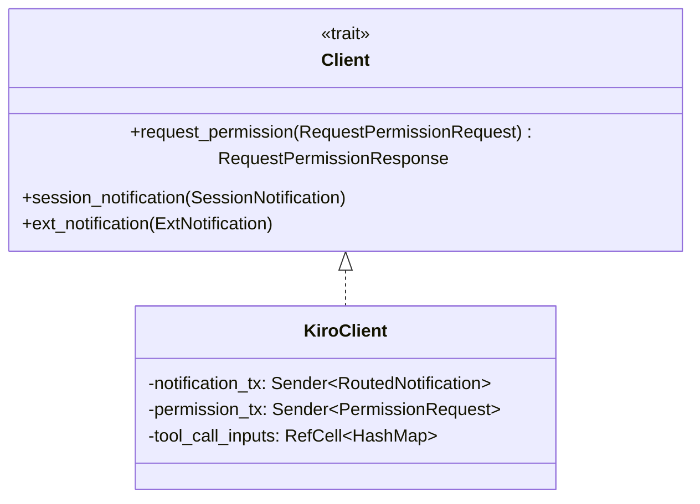
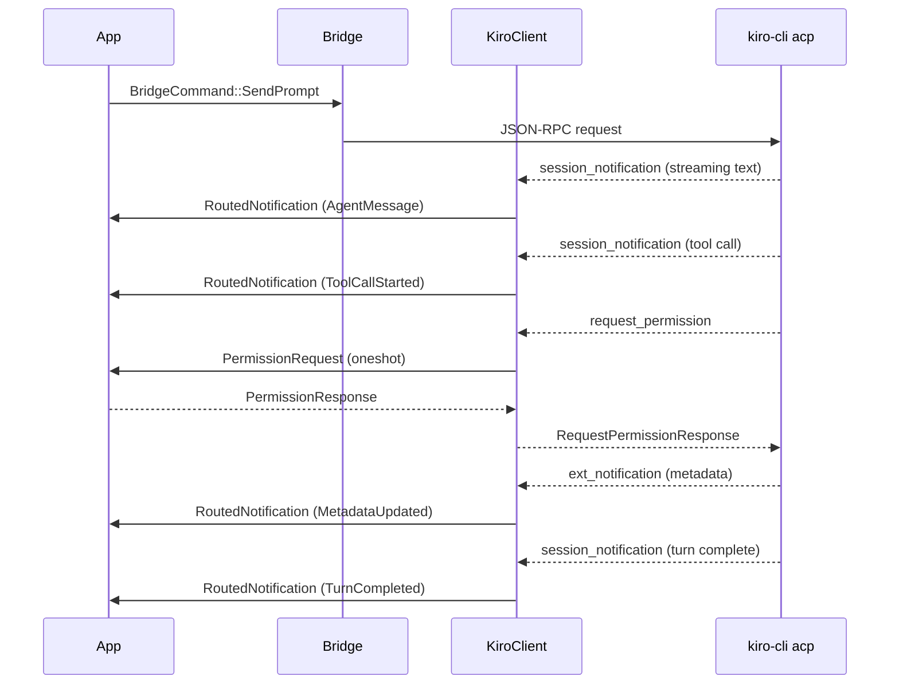
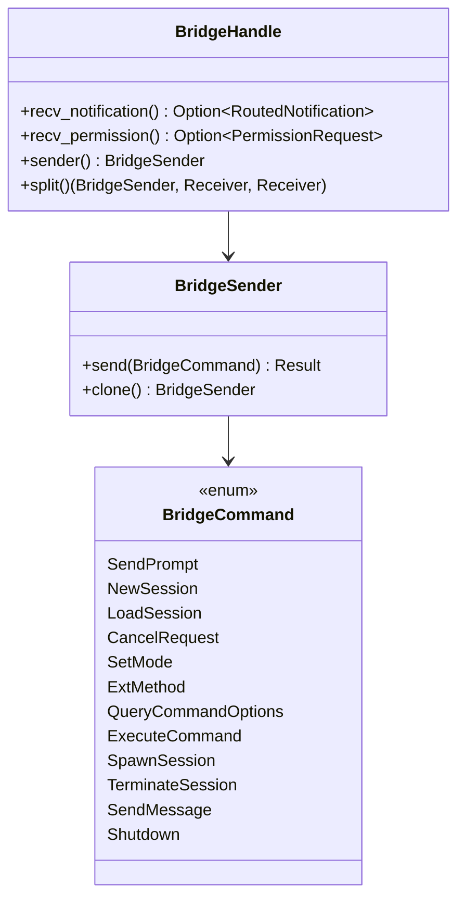
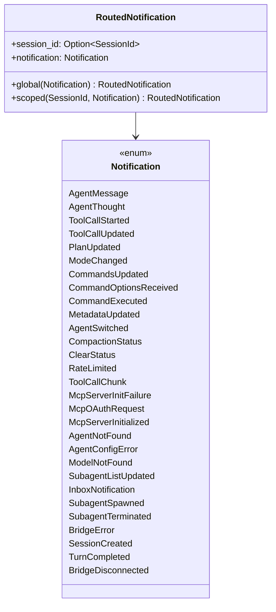
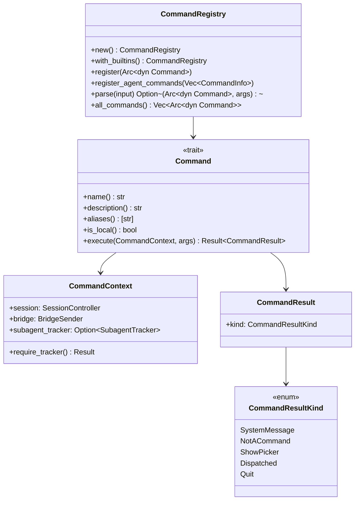
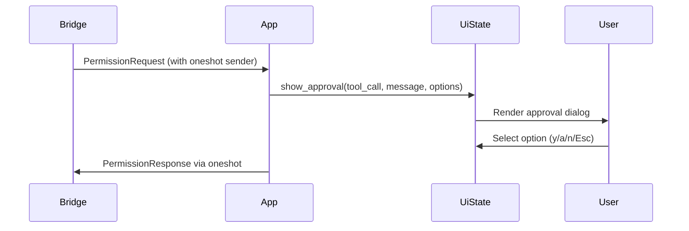

# Interfaces

> Generated: 2026-04-11 | Codebase: Cyril

## External Protocol: Agent Client Protocol (ACP)

Cyril communicates with `kiro-cli acp` over JSON-RPC 2.0 on stdio. The `agent-client-protocol` crate provides the transport and trait definitions.

### ACP Client Trait

`KiroClient` implements `acp::Client` (from the `agent-client-protocol` crate):



The trait is `!Send` (uses `async_trait(?Send)`) because `KiroClient` lives in the bridge thread and uses `RefCell`.

### ACP Message Flow



## Internal Interfaces

### Bridge Channels



### Notification System



All `Notification` variants are `Send + Sync + Clone`.

### Command System



### TuiState Trait

The renderer's read-only view of application state:

```mermaid
classDiagram
    class TuiState {
        <<trait>>
        +messages() [ChatMessage]
        +streaming_text() str
        +streaming_thought() Option~str~
        +messages_version() u64
        +active_tool_calls() [TrackedToolCall]
        +current_plan() Option~Plan~
        +input_text() str
        +input_cursor() usize
        +autocomplete_suggestions() [Suggestion]
        +autocomplete_selected() Option~usize~
        +activity() Activity
        +session_label() Option~str~
        +current_mode() Option~str~
        +current_model() Option~str~
        +context_usage() Option~f64~
        +credit_usage() Option~(f64, f64)~
        +approval() Option~ApprovalState~
        +picker() Option~PickerState~
        +hooks_panel() Option~HooksPanelState~
        +terminal_size() (u16, u16)
        +mouse_captured() bool
        +should_quit() bool
        +activity_elapsed() Option~Duration~
        +is_deep_idle() bool
        +subagent_tracker() SubagentTracker
        +subagent_ui() SubagentUiState
    }

    class UiState {
        implements TuiState
    }

    class MockTuiState {
        implements TuiState
        (test support)
    }

    TuiState <|.. UiState
    TuiState <|.. MockTuiState
```

### Permission Request Flow



The `PermissionRequest` is NOT Clone — it owns a `oneshot::Sender` for the response.

## Kiro Extension Methods

Cyril handles these `kiro.dev/*` extension notification methods:

| Method | Notification Variant | Purpose |
|--------|---------------------|---------|
| `kiro.dev/session/update` | Various (routed) | Session-scoped updates (tool chunks) |
| `kiro.dev/metadata` | `MetadataUpdated` | Context usage, metering, tokens |
| `kiro.dev/agent/switched` | `AgentSwitched` | Agent change confirmation |
| `kiro.dev/compaction/status` | `CompactionStatus` | Context compaction progress |
| `kiro.dev/clear/status` | `ClearStatus` | Clear operation status |
| `kiro.dev/commands/available` | `CommandsUpdated` | Available agent commands |
| `kiro.dev/rate-limit` | `RateLimited` | Rate limit notification |
| `kiro.dev/agent/not-found` | `AgentNotFound` | Agent lookup failure |
| `kiro.dev/agent/config-error` | `AgentConfigError` | Agent config error |
| `kiro.dev/model/not-found` | `ModelNotFound` | Model lookup failure |
| `kiro.dev/mcp/server-initialized` | `McpServerInitialized` | MCP server ready |
| `kiro.dev/mcp/server-init-failure` | `McpServerInitFailure` | MCP server failed |
| `kiro.dev/mcp/oauth-request` | `McpOAuthRequest` | MCP OAuth flow |
| `kiro.dev/subagent/list-update` | `SubagentListUpdated` | Subagent roster change |
| `kiro.dev/inbox/notification` | `InboxNotification` | Subagent inbox update |
| `kiro.dev/multi-session/*` | (acknowledged, not forwarded) | Multi-session lifecycle |
