# Workflows

## Overview

This document describes the key workflows and processes in Cyril, from user interactions to protocol communications and system operations.

## User Workflows

### Application Startup

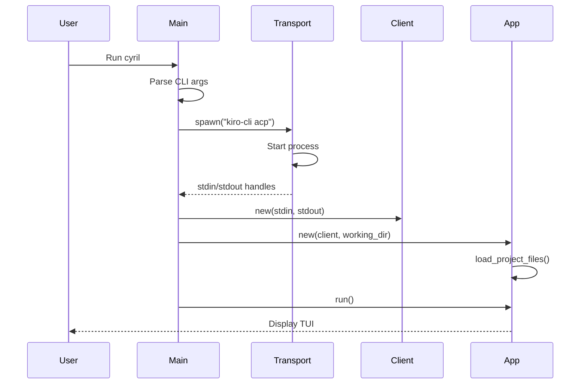
```mermaid
sequenceDiagram
    participant User
    participant Main
    participant Transport
    participant Client
    participant App
    
    User->>Main: Run cyril
    Main->>Main: Parse CLI args
    Main->>Transport: spawn("kiro-cli acp")
    Transport->>Transport: Start process
    Transport-->>Main: stdin/stdout handles
    Main->>Client: new(stdin, stdout)
    Main->>App: new(client, working_dir)
    App->>App: load_project_files()
    Main->>App: run()
    App-->>User: Display TUI
```

**Steps:**
1. Parse command-line arguments (working directory, prompt, etc.)
2. Spawn agent process (`kiro-cli acp`)
3. Create ACP client with stdio handles
4. Initialize application state
5. Load project files for completion
6. Enter main event loop
7. Display TUI

---

### Sending a Message

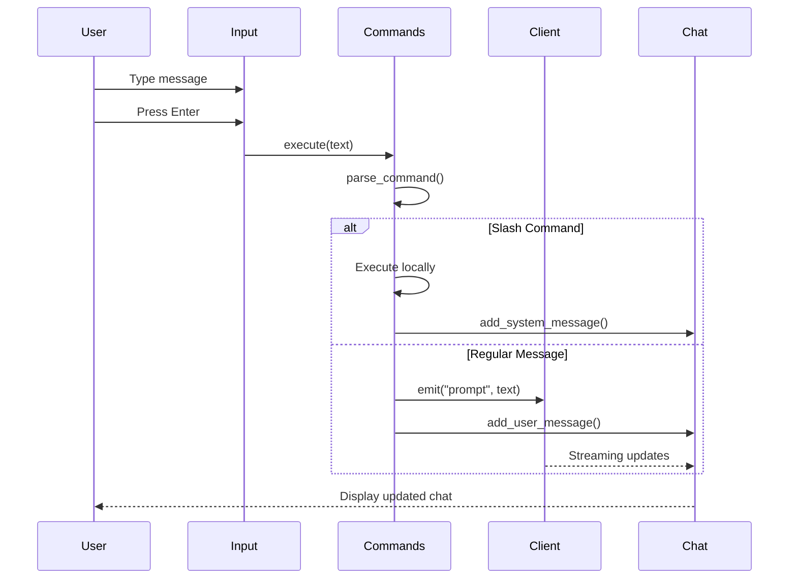
```mermaid
sequenceDiagram
    participant User
    participant Input
    participant Commands
    participant Client
    participant Chat
    
    User->>Input: Type message
    User->>Input: Press Enter
    Input->>Commands: execute(text)
    Commands->>Commands: parse_command()
    
    alt Slash Command
        Commands->>Commands: Execute locally
        Commands->>Chat: add_system_message()
    else Regular Message
        Commands->>Client: emit("prompt", text)
        Commands->>Chat: add_user_message()
        Client-->>Chat: Streaming updates
    end
    
    Chat-->>User: Display updated chat
```

**Steps:**
1. User types message in input field
2. User presses Enter
3. Command executor parses input
4. If slash command: execute locally
5. If regular message: send to agent via ACP
6. Add user message to chat history
7. Display streaming response as it arrives

---

### File Completion Workflow

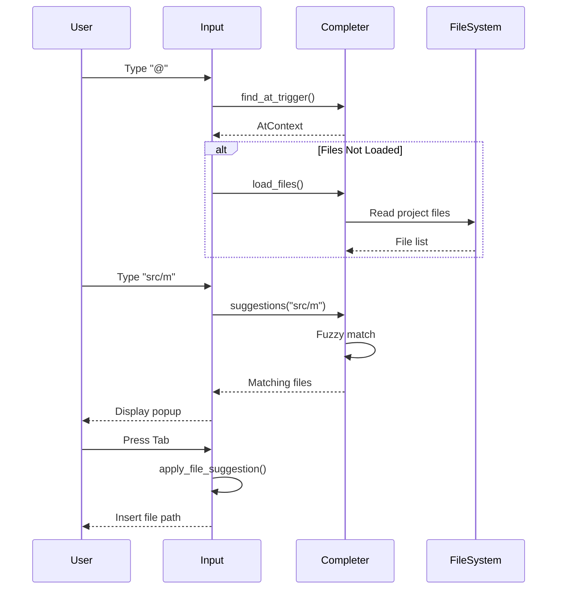
```mermaid
sequenceDiagram
    participant User
    participant Input
    participant Completer
    participant FileSystem
    
    User->>Input: Type "@"
    Input->>Completer: find_at_trigger()
    Completer-->>Input: AtContext
    
    alt Files Not Loaded
        Input->>Completer: load_files()
        Completer->>FileSystem: Read project files
        FileSystem-->>Completer: File list
    end
    
    User->>Input: Type "src/m"
    Input->>Completer: suggestions("src/m")
    Completer->>Completer: Fuzzy match
    Completer-->>Input: Matching files
    Input-->>User: Display popup
    
    User->>Input: Press Tab
    Input->>Input: apply_file_suggestion()
    Input-->>User: Insert file path
```

**Steps:**
1. User types `@` character
2. Detect @ trigger and position
3. Load project files if not already loaded
4. User continues typing query
5. Fuzzy match files against query
6. Display matching files in popup
7. User selects file with Tab or arrow keys
8. Insert selected file path into input

---

### Command Autocomplete Workflow

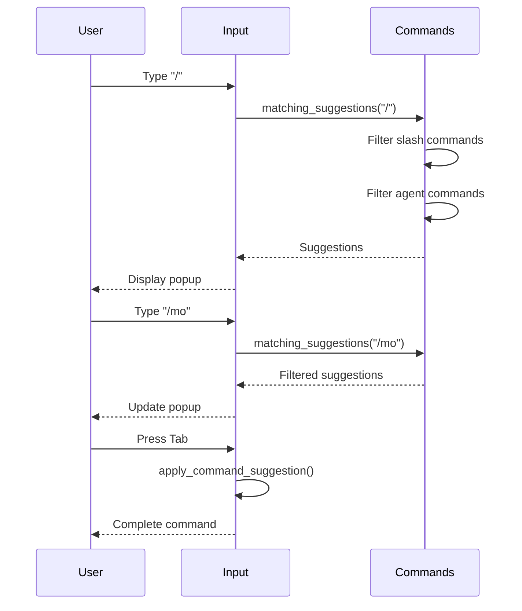
```mermaid
sequenceDiagram
    participant User
    participant Input
    participant Commands
    
    User->>Input: Type "/"
    Input->>Commands: matching_suggestions("/")
    Commands->>Commands: Filter slash commands
    Commands->>Commands: Filter agent commands
    Commands-->>Input: Suggestions
    Input-->>User: Display popup
    
    User->>Input: Type "/mo"
    Input->>Commands: matching_suggestions("/mo")
    Commands-->>Input: Filtered suggestions
    Input-->>User: Update popup
    
    User->>Input: Press Tab
    Input->>Input: apply_command_suggestion()
    Input-->>User: Complete command
```

**Steps:**
1. User types `/` character
2. Get all available commands (slash + agent)
3. Display command popup
4. User continues typing
5. Filter commands by prefix
6. Update popup with matches
7. User selects command with Tab
8. Complete command in input field

---

## Protocol Workflows

### Agent Request-Response

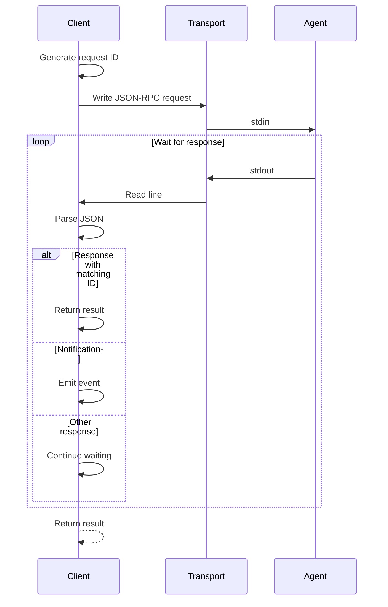
```mermaid
sequenceDiagram
    participant Client
    participant Transport
    participant Agent
    
    Client->>Client: Generate request ID
    Client->>Transport: Write JSON-RPC request
    Transport->>Agent: stdin
    
    loop Wait for response
        Agent->>Transport: stdout
        Transport->>Client: Read line
        Client->>Client: Parse JSON
        
        alt Response with matching ID
            Client->>Client: Return result
        else Notification
            Client->>Client: Emit event
        else Other response
            Client->>Client: Continue waiting
        end
    end
    
    Client-->>Client: Return result
```

**Steps:**
1. Generate unique request ID
2. Serialize request to JSON-RPC
3. Write to agent stdin
4. Read from agent stdout line by line
5. Parse each line as JSON
6. If response matches ID: return result
7. If notification: emit event and continue
8. If other response: continue waiting

---

### Streaming Response

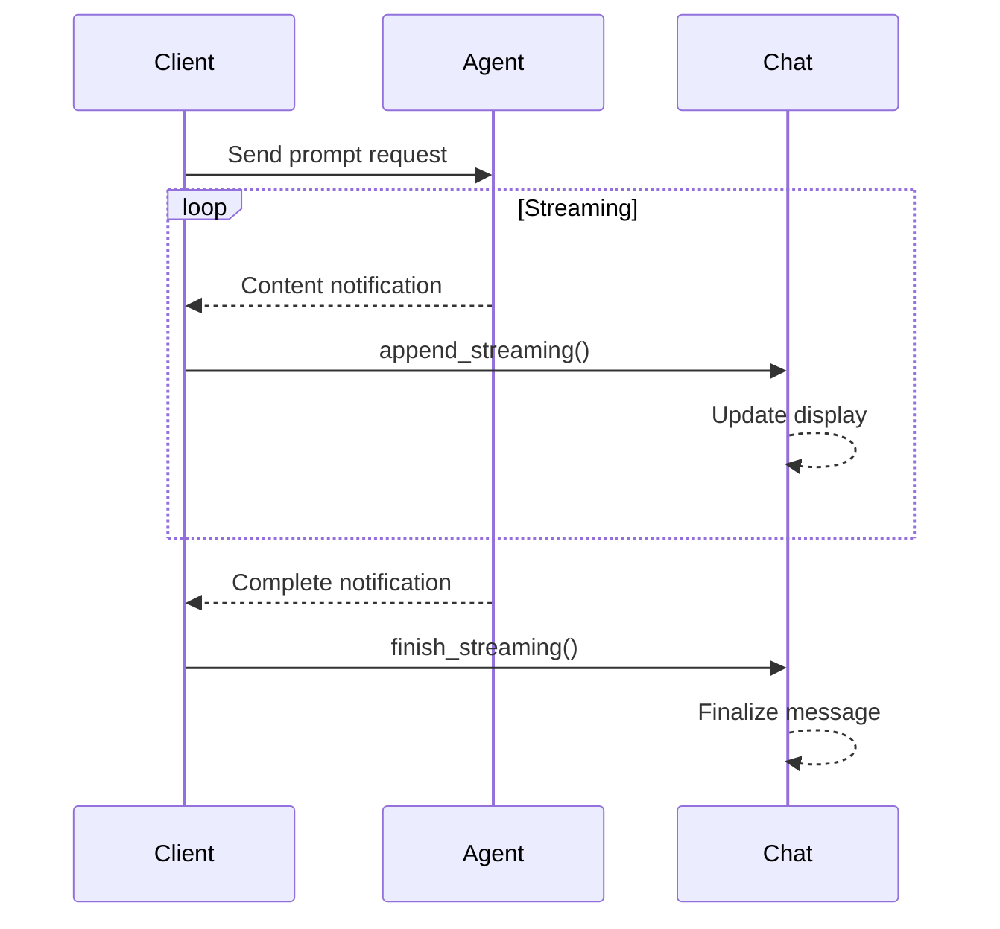
```mermaid
sequenceDiagram
    participant Client
    participant Agent
    participant Chat
    
    Client->>Agent: Send prompt request
    
    loop Streaming
        Agent-->>Client: Content notification
        Client->>Chat: append_streaming()
        Chat-->>Chat: Update display
    end
    
    Agent-->>Client: Complete notification
    Client->>Chat: finish_streaming()
    Chat-->>Chat: Finalize message
```

**Steps:**
1. Send prompt request to agent
2. Agent sends content notifications
3. Append each chunk to streaming buffer
4. Update UI with accumulated content
5. Agent sends completion notification
6. Finalize assistant message
7. Clear streaming buffer

---

### Tool Call Execution

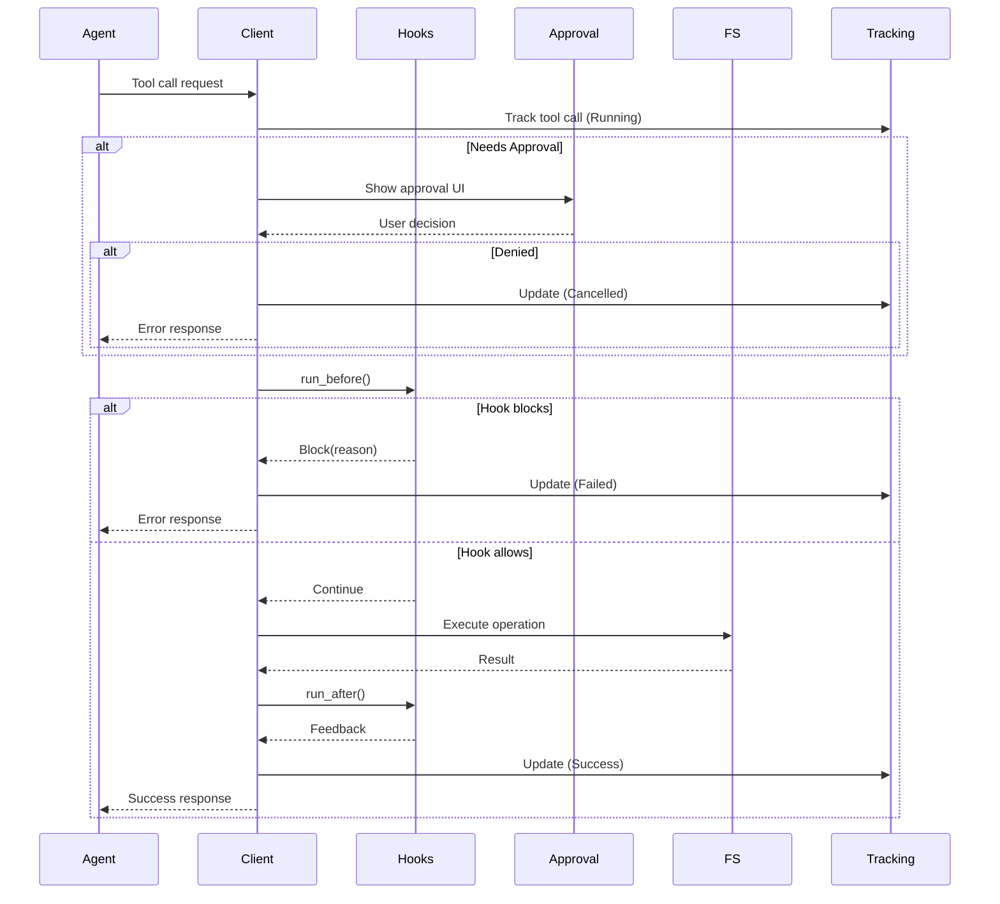
```mermaid
sequenceDiagram
    participant Agent
    participant Client
    participant Hooks
    participant Approval
    participant FS
    participant Tracking
    
    Agent->>Client: Tool call request
    Client->>Tracking: Track tool call (Running)
    
    alt Needs Approval
        Client->>Approval: Show approval UI
        Approval-->>Client: User decision
        
        alt Denied
            Client->>Tracking: Update (Cancelled)
            Client-->>Agent: Error response
        end
    end
    
    Client->>Hooks: run_before()
    
    alt Hook blocks
        Hooks-->>Client: Block(reason)
        Client->>Tracking: Update (Failed)
        Client-->>Agent: Error response
    else Hook allows
        Hooks-->>Client: Continue
        Client->>FS: Execute operation
        FS-->>Client: Result
        Client->>Hooks: run_after()
        Hooks-->>Client: Feedback
        Client->>Tracking: Update (Success)
        Client-->>Agent: Success response
    end
```

**Steps:**
1. Agent sends tool call request
2. Create tracked tool call (Running status)
3. Check if approval needed
4. If needed: show approval UI and wait
5. If denied: update status and return error
6. Run before hooks
7. If hook blocks: update status and return error
8. Execute file/terminal operation
9. Run after hooks (feedback only)
10. Update tool call status (Success/Failed)
11. Return result to agent

---

## File Operation Workflows

### File Write with Hooks

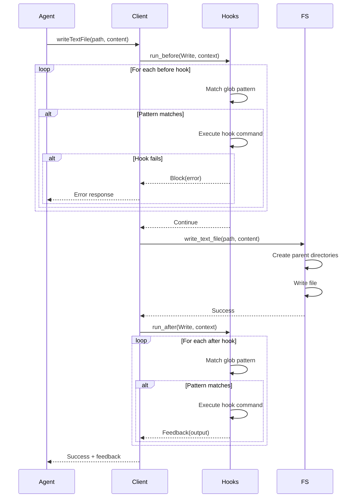
```mermaid
sequenceDiagram
    participant Agent
    participant Client
    participant Hooks
    participant FS
    
    Agent->>Client: writeTextFile(path, content)
    
    Client->>Hooks: run_before(Write, context)
    
    loop For each before hook
        Hooks->>Hooks: Match glob pattern
        
        alt Pattern matches
            Hooks->>Hooks: Execute hook command
            
            alt Hook fails
                Hooks-->>Client: Block(error)
                Client-->>Agent: Error response
            end
        end
    end
    
    Hooks-->>Client: Continue
    Client->>FS: write_text_file(path, content)
    FS->>FS: Create parent directories
    FS->>FS: Write file
    FS-->>Client: Success
    
    Client->>Hooks: run_after(Write, context)
    
    loop For each after hook
        Hooks->>Hooks: Match glob pattern
        
        alt Pattern matches
            Hooks->>Hooks: Execute hook command
            Hooks-->>Client: Feedback(output)
        end
    end
    
    Client-->>Agent: Success + feedback
```

**Steps:**
1. Agent requests file write
2. Run before hooks with file context
3. For each hook: check glob pattern match
4. If matches: execute hook command
5. If hook fails: block operation and return error
6. If all hooks pass: proceed with write
7. Create parent directories if needed
8. Write file content
9. Run after hooks
10. Collect feedback from hooks
11. Return success with feedback to agent

---

### File Read

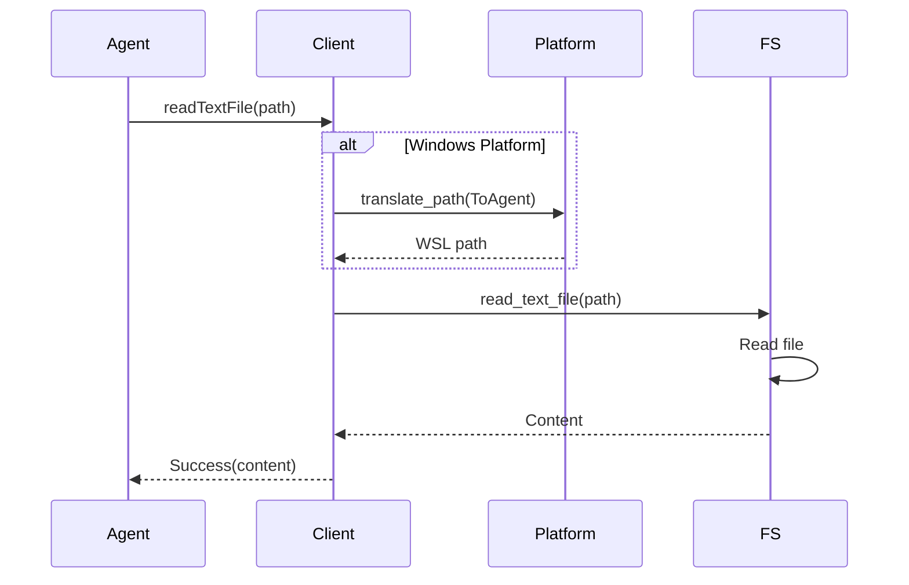
```mermaid
sequenceDiagram
    participant Agent
    participant Client
    participant Platform
    participant FS
    
    Agent->>Client: readTextFile(path)
    
    alt Windows Platform
        Client->>Platform: translate_path(ToAgent)
        Platform-->>Client: WSL path
    end
    
    Client->>FS: read_text_file(path)
    FS->>FS: Read file
    FS-->>Client: Content
    
    Client-->>Agent: Success(content)
```

**Steps:**
1. Agent requests file read
2. If Windows: translate path to WSL format
3. Read file from filesystem
4. Return content to agent

---

## Terminal Workflows

### Terminal Creation and Execution

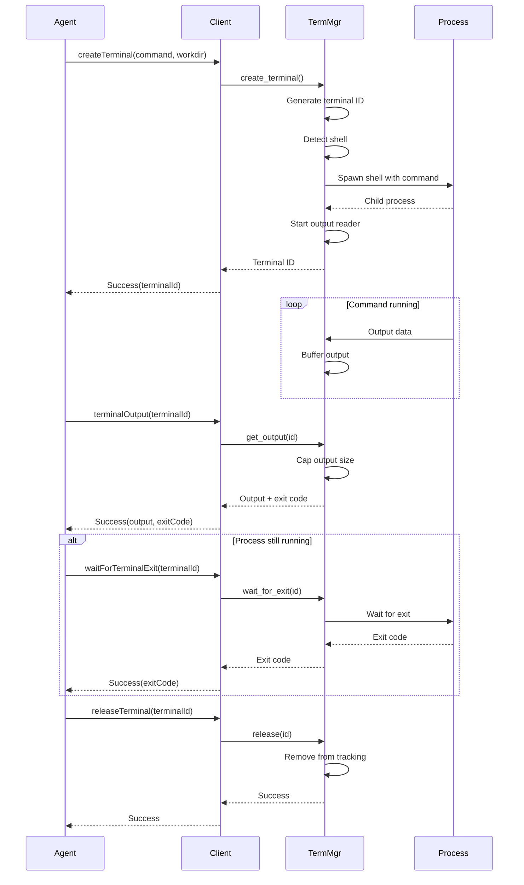
```mermaid
sequenceDiagram
    participant Agent
    participant Client
    participant TermMgr
    participant Process
    
    Agent->>Client: createTerminal(command, workdir)
    Client->>TermMgr: create_terminal()
    TermMgr->>TermMgr: Generate terminal ID
    TermMgr->>TermMgr: Detect shell
    TermMgr->>Process: Spawn shell with command
    Process-->>TermMgr: Child process
    TermMgr->>TermMgr: Start output reader
    TermMgr-->>Client: Terminal ID
    Client-->>Agent: Success(terminalId)
    
    loop Command running
        Process->>TermMgr: Output data
        TermMgr->>TermMgr: Buffer output
    end
    
    Agent->>Client: terminalOutput(terminalId)
    Client->>TermMgr: get_output(id)
    TermMgr->>TermMgr: Cap output size
    TermMgr-->>Client: Output + exit code
    Client-->>Agent: Success(output, exitCode)
    
    alt Process still running
        Agent->>Client: waitForTerminalExit(terminalId)
        Client->>TermMgr: wait_for_exit(id)
        TermMgr->>Process: Wait for exit
        Process-->>TermMgr: Exit code
        TermMgr-->>Client: Exit code
        Client-->>Agent: Success(exitCode)
    end
    
    Agent->>Client: releaseTerminal(terminalId)
    Client->>TermMgr: release(id)
    TermMgr->>TermMgr: Remove from tracking
    TermMgr-->>Client: Success
    Client-->>Agent: Success
```

**Steps:**
1. Agent requests terminal creation
2. Generate unique terminal ID
3. Detect available shell (bash, zsh, fish, pwsh)
4. Spawn shell process with command
5. Start async output reader
6. Return terminal ID to agent
7. Agent requests output
8. Read buffered output
9. Cap output to prevent memory issues
10. Return output and exit code (if available)
11. If still running: agent can wait for exit
12. Agent releases terminal
13. Clean up process and tracking

---

### Terminal Output Capping

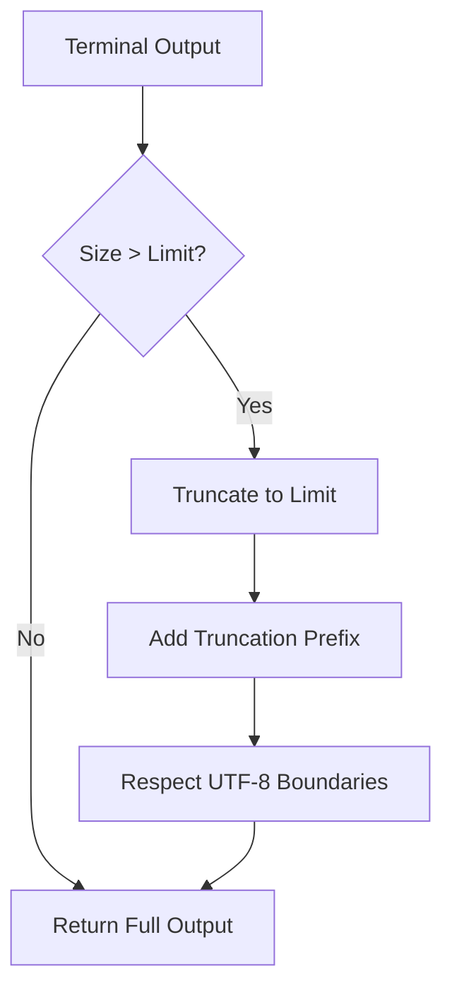
```mermaid
graph TB
    Output[Terminal Output] --> Check{Size > Limit?}
    Check -->|No| Return[Return Full Output]
    Check -->|Yes| Truncate[Truncate to Limit]
    Truncate --> Prefix[Add Truncation Prefix]
    Prefix --> Boundary[Respect UTF-8 Boundaries]
    Boundary --> Return
```

**Steps:**
1. Read terminal output buffer
2. Check if size exceeds limit (default: 100KB)
3. If under limit: return full output
4. If over limit: truncate to most recent content
5. Add prefix indicating truncation
6. Ensure truncation respects UTF-8 character boundaries
7. Return capped output

---

## Session Workflows

### Session Creation

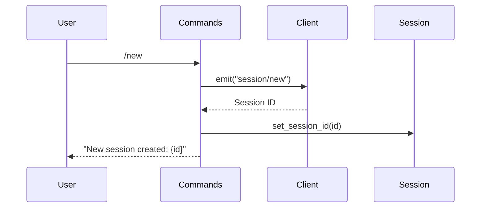
```mermaid
sequenceDiagram
    participant User
    participant Commands
    participant Client
    participant Session
    
    User->>Commands: /new
    Commands->>Client: emit("session/new")
    Client-->>Commands: Session ID
    Commands->>Session: set_session_id(id)
    Commands-->>User: "New session created: {id}"
```

**Steps:**
1. User enters `/new` command
2. Send session creation request to agent
3. Agent returns new session ID
4. Update session context
5. Display confirmation message

---

### Session Loading

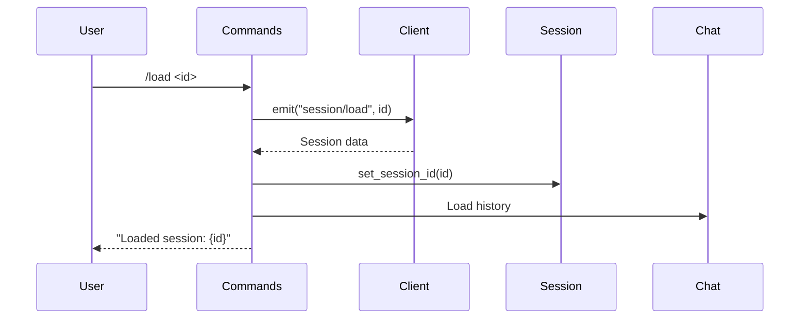
```mermaid
sequenceDiagram
    participant User
    participant Commands
    participant Client
    participant Session
    participant Chat
    
    User->>Commands: /load <id>
    Commands->>Client: emit("session/load", id)
    Client-->>Commands: Session data
    Commands->>Session: set_session_id(id)
    Commands->>Chat: Load history
    Commands-->>User: "Loaded session: {id}"
```

**Steps:**
1. User enters `/load <id>` command
2. Send session load request to agent
3. Agent returns session data
4. Update session context
5. Load chat history
6. Display confirmation message

---

### Model Selection

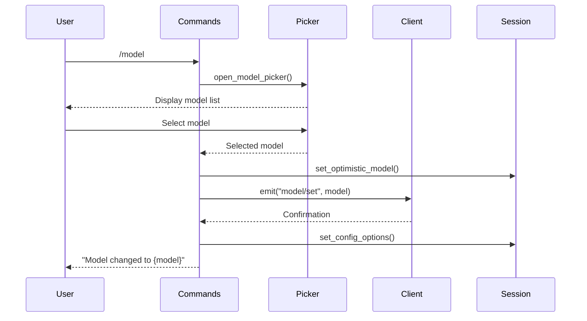
```mermaid
sequenceDiagram
    participant User
    participant Commands
    participant Picker
    participant Client
    participant Session
    
    User->>Commands: /model
    Commands->>Picker: open_model_picker()
    Picker-->>User: Display model list
    User->>Picker: Select model
    Picker-->>Commands: Selected model
    Commands->>Session: set_optimistic_model()
    Commands->>Client: emit("model/set", model)
    Client-->>Commands: Confirmation
    Commands->>Session: set_config_options()
    Commands-->>User: "Model changed to {model}"
```

**Steps:**
1. User enters `/model` command
2. Open model picker UI
3. Display available models
4. User selects model
5. Optimistically update session context
6. Send model change request to agent
7. Agent confirms change
8. Update session with confirmed model
9. Display confirmation message

---

## Path Translation Workflows (Windows)

### Windows to WSL Translation

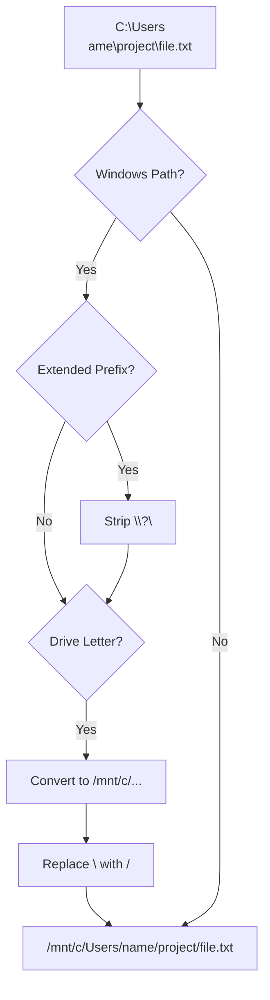
```mermaid
graph TB
    Input["C:\Users\name\project\file.txt"]
    Detect{Windows Path?}
    Extended{Extended Prefix?}
    Strip[Strip \\?\]
    Drive{Drive Letter?}
    Convert[Convert to /mnt/c/...]
    Slashes[Replace \ with /]
    Output["/mnt/c/Users/name/project/file.txt"]
    
    Input --> Detect
    Detect -->|Yes| Extended
    Extended -->|Yes| Strip
    Extended -->|No| Drive
    Strip --> Drive
    Drive -->|Yes| Convert
    Convert --> Slashes
    Slashes --> Output
    Detect -->|No| Output
```

**Steps:**
1. Detect if path is Windows format
2. Check for extended prefix (`\\?\`)
3. If extended: strip prefix
4. Check for drive letter
5. Convert drive to `/mnt/{drive}`
6. Replace backslashes with forward slashes
7. Return WSL path

---

### WSL to Windows Translation

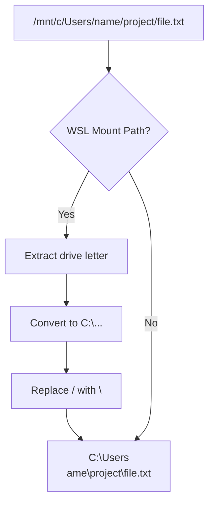
```mermaid
graph TB
    Input["/mnt/c/Users/name/project/file.txt"]
    Detect{WSL Mount Path?}
    Extract[Extract drive letter]
    Convert["Convert to C:\..."]
    Slashes[Replace / with \]
    Output["C:\Users\name\project\file.txt"]
    
    Input --> Detect
    Detect -->|Yes| Extract
    Extract --> Convert
    Convert --> Slashes
    Slashes --> Output
    Detect -->|No| Output
```

**Steps:**
1. Detect if path is WSL mount format
2. Extract drive letter from `/mnt/{drive}`
3. Convert to Windows drive format
4. Replace forward slashes with backslashes
5. Return Windows path

---

### JSON Payload Translation

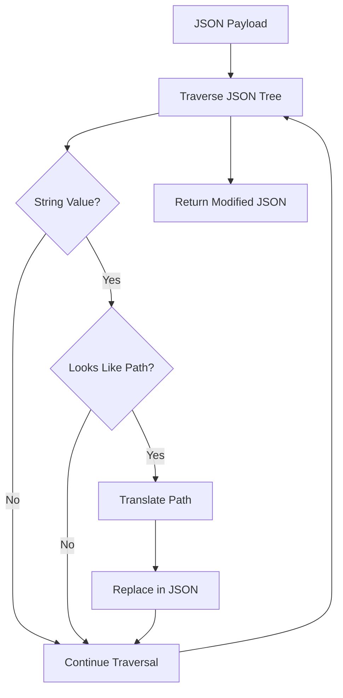
```mermaid
graph TB
    JSON[JSON Payload]
    Traverse[Traverse JSON Tree]
    String{String Value?}
    Path{Looks Like Path?}
    Translate[Translate Path]
    Replace[Replace in JSON]
    Continue[Continue Traversal]
    Done[Return Modified JSON]
    
    JSON --> Traverse
    Traverse --> String
    String -->|Yes| Path
    String -->|No| Continue
    Path -->|Yes| Translate
    Path -->|No| Continue
    Translate --> Replace
    Replace --> Continue
    Continue --> Traverse
    Traverse --> Done
```

**Steps:**
1. Receive JSON payload
2. Recursively traverse JSON tree
3. For each string value: check if it looks like a path
4. If path: translate based on direction
5. Replace value in JSON
6. Continue traversal
7. Return modified JSON

---

## Hook Execution Workflows

### Hook Registration

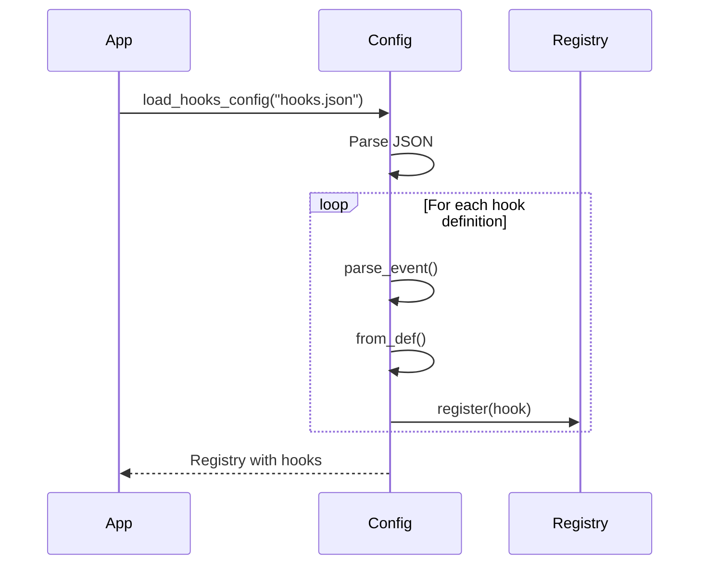
```mermaid
sequenceDiagram
    participant App
    participant Config
    participant Registry
    
    App->>Config: load_hooks_config("hooks.json")
    Config->>Config: Parse JSON
    
    loop For each hook definition
        Config->>Config: parse_event()
        Config->>Config: from_def()
        Config->>Registry: register(hook)
    end
    
    Config-->>App: Registry with hooks
```

**Steps:**
1. Load `hooks.json` from working directory
2. Parse JSON configuration
3. For each hook definition:
   - Parse event type (beforeWrite, afterWrite, etc.)
   - Create hook instance with glob filter
   - Register hook in registry
4. Return configured registry

---

### Hook Execution

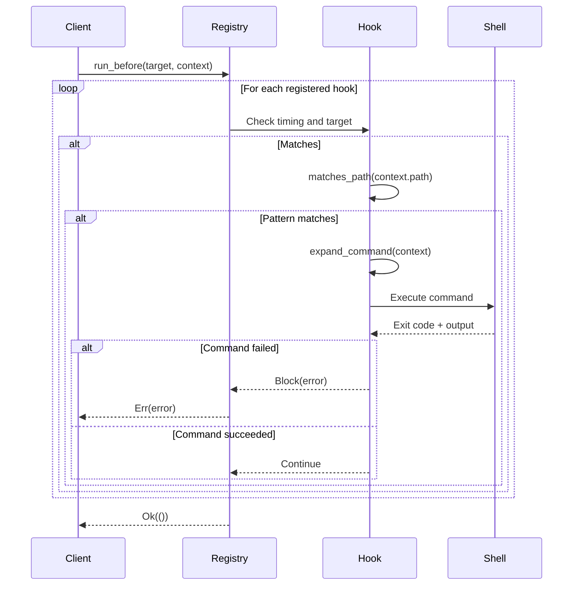
```mermaid
sequenceDiagram
    participant Client
    participant Registry
    participant Hook
    participant Shell
    
    Client->>Registry: run_before(target, context)
    
    loop For each registered hook
        Registry->>Hook: Check timing and target
        
        alt Matches
            Hook->>Hook: matches_path(context.path)
            
            alt Pattern matches
                Hook->>Hook: expand_command(context)
                Hook->>Shell: Execute command
                Shell-->>Hook: Exit code + output
                
                alt Command failed
                    Hook-->>Registry: Block(error)
                    Registry-->>Client: Err(error)
                else Command succeeded
                    Hook-->>Registry: Continue
                end
            end
        end
    end
    
    Registry-->>Client: Ok(())
```

**Steps:**
1. Client calls `run_before()` or `run_after()`
2. Registry iterates registered hooks
3. For each hook: check timing and target match
4. If matches: check glob pattern against path
5. If pattern matches: expand command placeholders
6. Execute shell command
7. If before hook fails: block operation
8. If after hook fails: log but continue
9. Return result to client

---

## Error Handling Workflows

### Protocol Error Handling

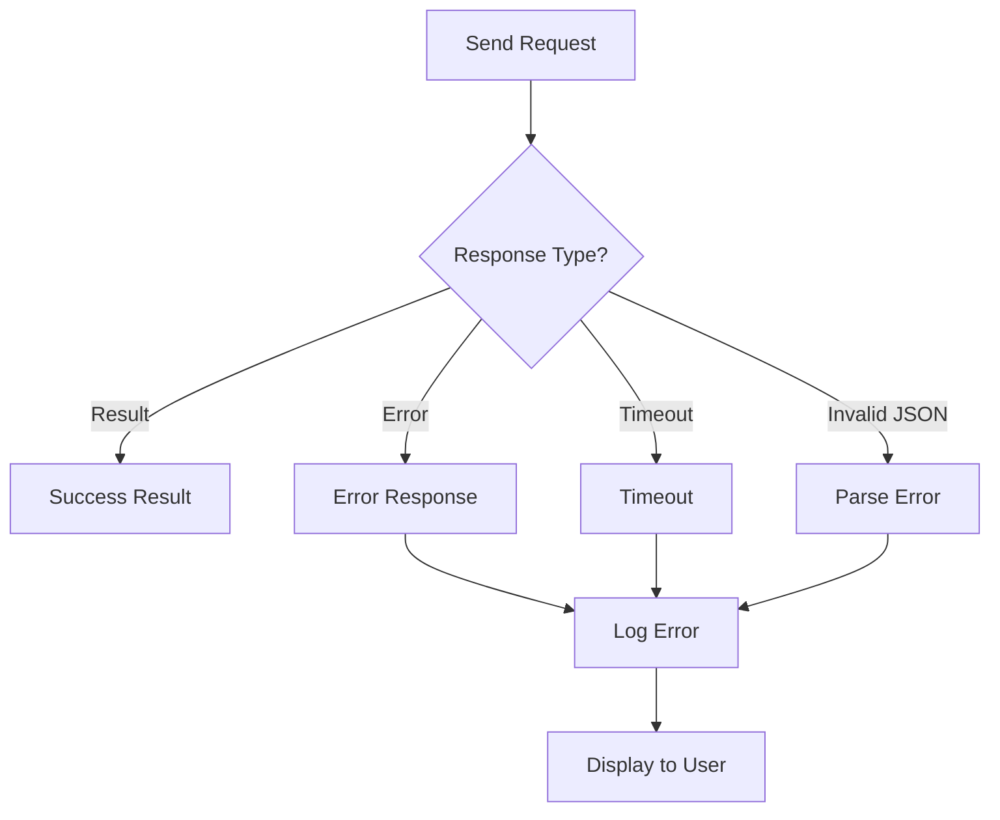
```mermaid
graph TB
    Request[Send Request]
    Response{Response Type?}
    Success[Success Result]
    Error[Error Response]
    Timeout[Timeout]
    Parse[Parse Error]
    
    Request --> Response
    Response -->|Result| Success
    Response -->|Error| Error
    Response -->|Timeout| Timeout
    Response -->|Invalid JSON| Parse
    
    Error --> Log[Log Error]
    Timeout --> Log
    Parse --> Log
    Log --> Display[Display to User]
```

**Steps:**
1. Send request to agent
2. Wait for response
3. If success: return result
4. If error: parse error message
5. If timeout: generate timeout error
6. If invalid JSON: generate parse error
7. Log error details
8. Display error to user

---

### Tool Call Error Handling

```mermaid
graph TB
    ToolCall[Tool Call Request]
    Approval{Needs Approval?}
    Denied[User Denies]
    Hook{Hook Blocks?}
    Execute[Execute Operation]
    Fail{Operation Fails?}
    
    ToolCall --> Approval
    Approval -->|Yes| Denied
    Approval -->|No| Hook
    Denied --> Error[Return Error]
    Hook -->|Yes| Error
    Hook -->|No| Execute
    Execute --> Fail
    Fail -->|Yes| Error
    Fail -->|No| Success[Return Success]
    
    Error --> Track[Update Tracking: Failed]
    Success --> Track2[Update Tracking: Success]
```

**Steps:**
1. Receive tool call request
2. Check if approval needed
3. If denied: return error and update tracking
4. Run before hooks
5. If hook blocks: return error and update tracking
6. Execute operation
7. If operation fails: return error and update tracking
8. If operation succeeds: return success and update tracking

---

## Performance Optimization Workflows

### Lazy File Loading

```mermaid
graph TB
    User[User Types @]
    Check{Files Loaded?}
    Load[Load Project Files]
    Cache[Cache File List]
    Match[Fuzzy Match]
    Display[Display Suggestions]
    
    User --> Check
    Check -->|No| Load
    Load --> Cache
    Cache --> Match
    Check -->|Yes| Match
    Match --> Display
```

**Steps:**
1. User triggers file completion with `@`
2. Check if files already loaded
3. If not loaded: scan project directory
4. Cache file list for future use
5. Perform fuzzy matching on query
6. Display matching suggestions

---

### Streaming Rendering

```mermaid
graph TB
    Chunk[Receive Content Chunk]
    Append[Append to Buffer]
    Parse[Parse Markdown]
    Render[Render to Terminal]
    Display[Update Display]
    
    Chunk --> Append
    Append --> Parse
    Parse --> Render
    Render --> Display
    Display -.Next Chunk.-> Chunk
```

**Steps:**
1. Receive content chunk from agent
2. Append to streaming buffer
3. Parse accumulated markdown
4. Render to terminal lines
5. Update display
6. Repeat for next chunk

---

## Shutdown Workflow

```mermaid
sequenceDiagram
    participant User
    participant App
    participant TermMgr
    participant Client
    participant Transport
    
    User->>App: Ctrl+C or /quit
    App->>App: Set should_quit flag
    App->>TermMgr: Release all terminals
    
    loop For each terminal
        TermMgr->>TermMgr: Kill process
        TermMgr->>TermMgr: Remove from tracking
    end
    
    App->>Client: Close connection
    Client->>Transport: Close stdin
    Transport->>Transport: Wait for process exit
    App->>App: Restore terminal
    App-->>User: Exit
```

**Steps:**
1. User triggers quit (Ctrl+C or `/quit`)
2. Set quit flag in app state
3. Release all tracked terminals
4. Kill terminal processes
5. Close ACP client connection
6. Close agent stdin
7. Wait for agent process to exit
8. Restore terminal to normal mode
9. Exit application
