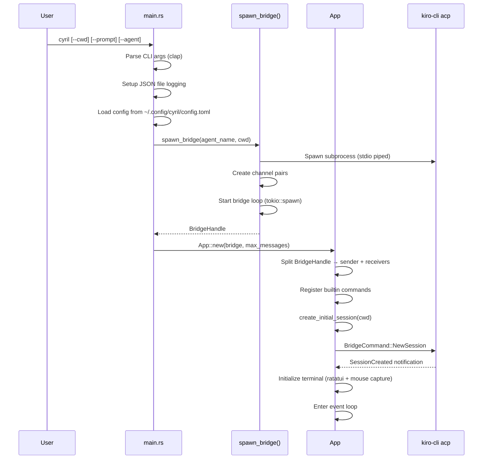
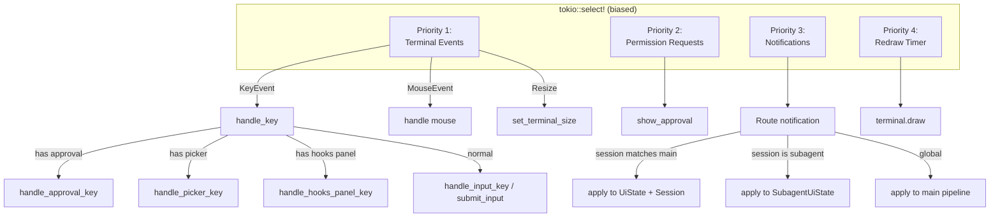
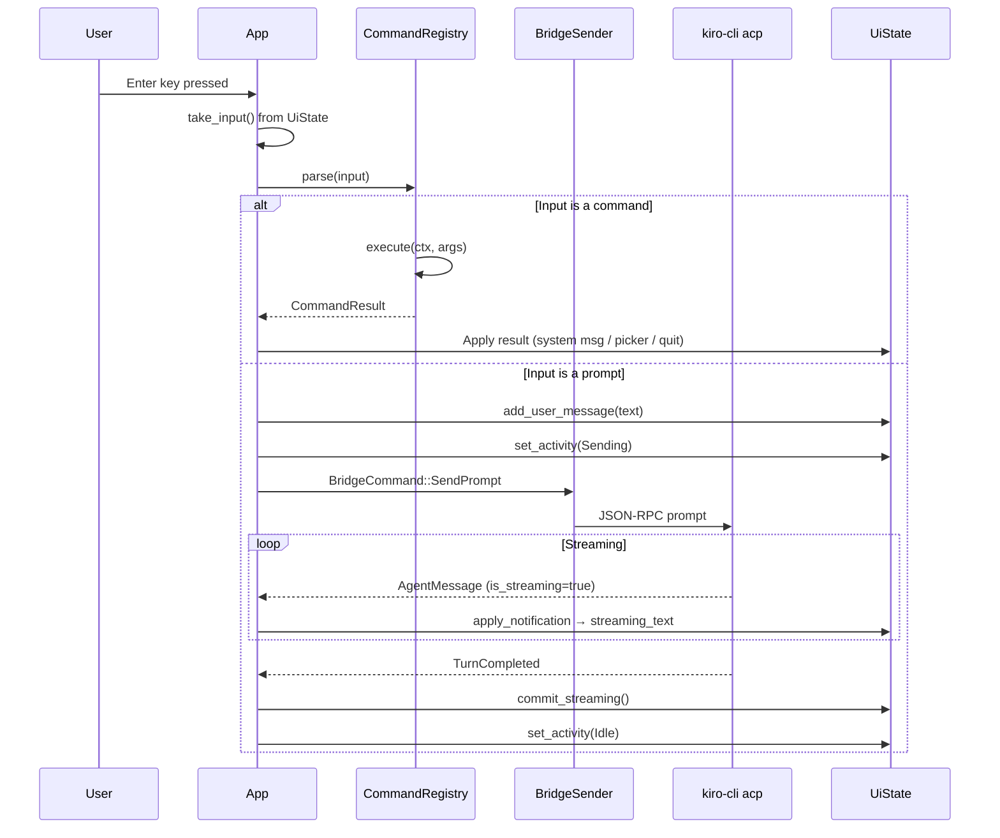
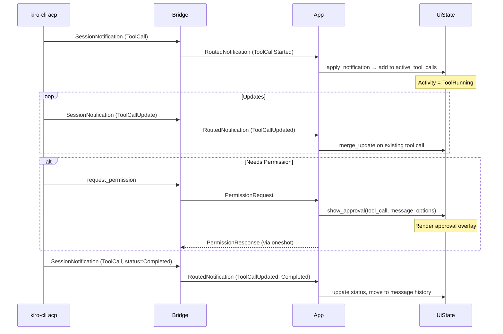
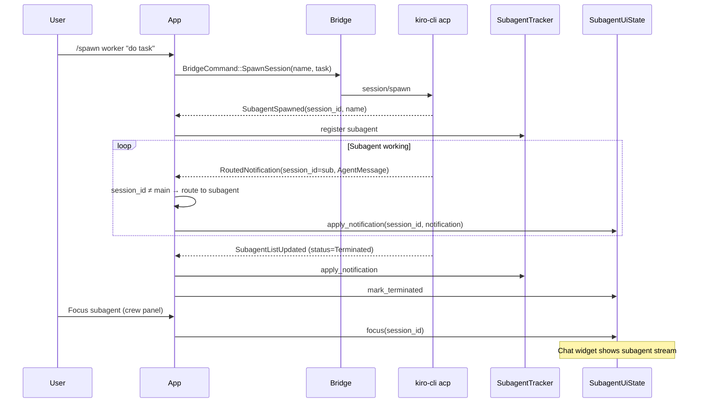
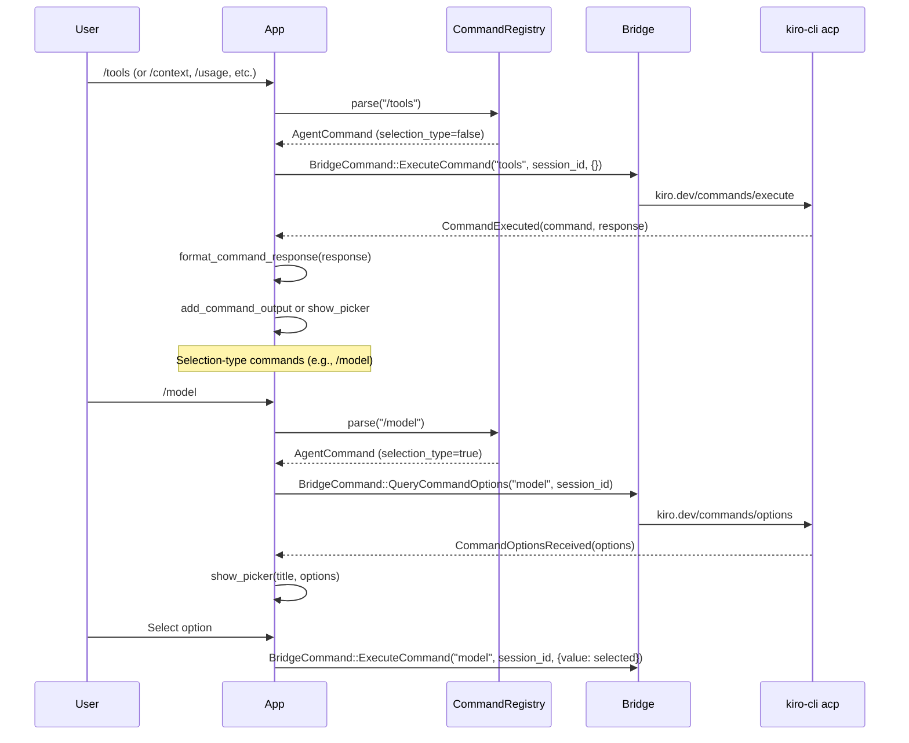
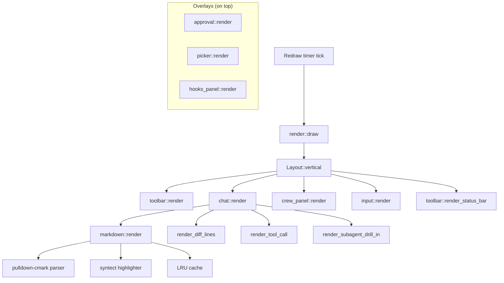
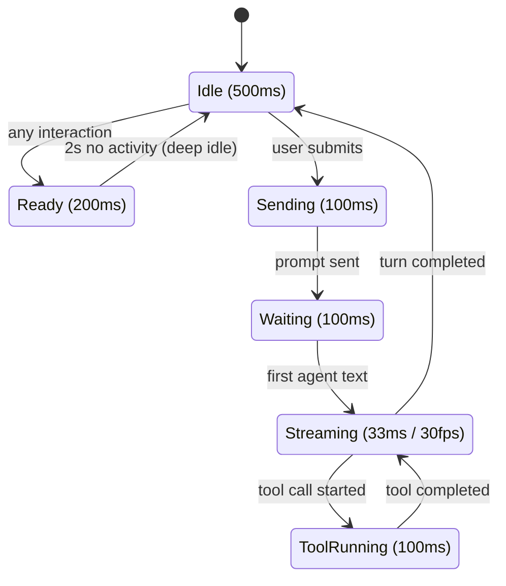

# Workflows

> Generated: 2026-04-11 | Codebase: Cyril

## Application Startup



## Event Loop (App::run)



## User Input → Agent Response



## Tool Call Lifecycle



## Subagent Lifecycle



## Command Execution (Agent Commands)



## Rendering Pipeline



## Adaptive Frame Rate



The `redraw_duration()` method maps `Activity` to frame intervals. Deep idle (2s+ no activity) further reduces to 1s intervals.

## Path Translation (Windows/WSL)

```mermaid
graph LR
    WIN[C:\Users\name\file.txt] -->|win_to_wsl| WSL[/mnt/c/Users/name/file.txt]
    WSL -->|wsl_to_win| WIN
    JSON[JSON payload] -->|translate_paths_in_json| JSON2[Translated JSON]
```

Automatic recursive translation in JSON payloads. Detects paths by drive letter prefix (`C:\`) or WSL mount prefix (`/mnt/`).
