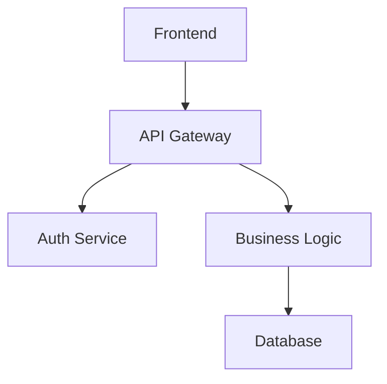
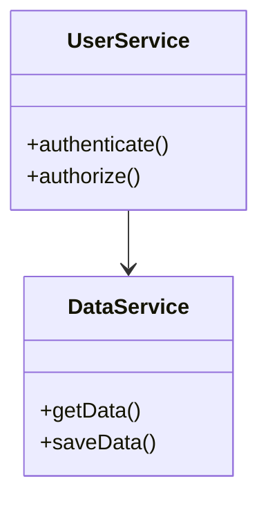
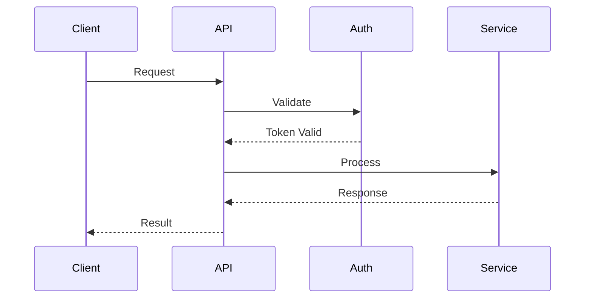

You MUST NOT include volatile metrics that become stale after code changes, such as lines-of-code counts, file sizes, byte counts, or specific line counts because these create documentation that is immediately outdated and erodes trust in the generated content
- You MUST NOT include specific build, test, lint, or format commands unless they are non-obvious or specific to the repository because common build commands are better provided by centralized tooling and skills rather than duplicated across every context file
- You MUST place consolidated files in the codebase root directory (outside of the output_dir)
- If consolidate_prompt is provided, you MUST use it to guide the structure and content of the consolidated files
- You MUST tailor the consolidated content to each target file type:
  - AGENTS.md: Provide a starting point for navigating the codebase by documenting major subsystems, key entry points, and directory organization so agents can locate relevant code without reading every file. Focus on repo-specific tools, patterns that deviate from language/framework defaults, and information discoverable from config files (CI, linters, git hooks) that agents might otherwise miss. SHOULD avoid duplicating information already present in README.md or CONTRIBUTING.md because redundant content increases token cost, but MAY include brief summaries of critical setup information to make the file more self-contained. Deprioritize exhaustive file-by-file directory listings and generic descriptions that don't aid navigation. You MUST include a "Custom Instructions" section at the end of the file with the following format:
    ```
    ## Custom Instructions
    <!-- This section is for human and agent-maintained operational knowledge.
         Add repo-specific conventions, gotchas, and workflow rules here.
         This section is preserved exactly as-is when re-running codebase-summary. -->
    ```
    On a fresh generation (no existing AGENTS.md), this section MUST be empty (containing only the heading and comment). If an existing AGENTS.md has a Custom Instructions section, its content MUST be preserved exactly as-is in the new file
  - README.md: Focus on project overview, installation, usage, and getting started information
  - CONTRIBUTING.md: Focus on development setup, coding standards, contribution workflow, and guidelines
  - Other files: Adapt content based on filename and consolidate_prompt
- You MUST organize the consolidated content in a coherent structure appropriate for the target audience
- You MUST include a comprehensive table of contents with descriptive summaries
- You MUST add metadata tags to each section to facilitate targeted information retrieval
- You MUST include cross-references between related sections
- You MUST include information from all relevant documentation files
- If consolidate is false, you MUST skip this step and inform the user that no consolidated files will be created

### 6. Summary and Next Steps

Provide a summary of the documentation process and suggest next steps.

**Constraints:**
- You MUST summarize what has been accomplished
- You MUST suggest next steps for using the documentation
- You MUST provide guidance on maintaining and updating the documentation
- You MUST include specific instructions for adding the documentation to AI assistant context:
  - Recommend using the index.md file as the primary context file
  - Explain how AI assistants can leverage the index.md file as a knowledge base to find relevant information
  - Emphasize that the index.md contains sufficient metadata for assistants to understand which files contain detailed information
  - Provide example queries that demonstrate how to effectively use the documentation
- If consolidate is true, you MUST provide guidance on using the consolidated files

## Examples

### Example Input (Default AGENTS.md)
```
output_dir: ".agents/summary"
consolidate: true
consolidate_targets: "AGENTS.md"
consolidate_prompt: "Create a concise AGENTS.md that provides a starting point for navigating the codebase. Document major subsystems, key entry points, and directory organization so agents can locate relevant code without reading every file. Include: (1) directory overview and component map, (2) repo-specific tools and scripts found in the codebase, (3) patterns that deviate from language/framework defaults, (4) information discoverable from config files (CI, linters, git hooks) that agents might otherwise miss. Do NOT include: exhaustive file-by-file directory listings, generic component descriptions that don't aid navigation, general programming best practices, volatile metrics like lines-of-code counts or file sizes, standard build/test/lint commands that are common to the language or framework, or fabricated acronyms. End with an empty 'Custom Instructions' section for human/agent-maintained conventions."
codebase_path: "/path/to/project"
```

### Example Output (Generate Mode)
```
Setting up directory structure...
✅ Created directory .agents/summary/
✅ Created subdirectories for documentation artifacts

Analyzing codebase structure...
✅ Found 15 packages across 3 programming languages
✅ Identified 45 major components and 12 key interfaces
✅ Codebase information saved to .agents/summary/codebase_info.md

Generating documentation files...
✅ Created index.md with knowledge base metadata
✅ Generated architecture.md, components.md, interfaces.md
✅ Generated data_models.md, workflows.md, dependencies.md

Reviewing documentation...
✅ Consistency check complete
✅ Completeness check complete
✅ Review notes saved to .agents/summary/review_notes.md

Consolidating documentation...
✅ Created AGENTS.md optimized for AI coding assistants
✅ Included comprehensive project context and development guidance

Summary and Next Steps:
✅ Documentation generation complete!
✅ To use with AI assistants, add .agents/summary/index.md to context
✅ AGENTS.md provides comprehensive guidance for AI coding assistance
```

### Example Input (README.md)
```
consolidate_targets: "README.md"
consolidate_prompt: "Create a user-friendly README that explains the project purpose, installation, and usage"
```

### Example Input (No Consolidation)
```
consolidate: false
check_consistency: true
check_completeness: true
```

### Example Output Structure
```
AGENTS.md (consolidated file in root directory)
.agents/summary/
├── index.md (knowledge base index)
├── codebase_info.md
├── architecture.md
├── components.md
├── interfaces.md
├── data_models.md
├── workflows.md
├── dependencies.md
└── review_notes.md
```

### Example Mermaid Diagram Types
The documentation will include various Mermaid diagram types:

**Architecture Overview:**


**Component Relationships:**


**API Workflows:**


## Troubleshooting

### Large Codebase Performance
For very large codebases that take significant time to analyze:
- You SHOULD provide progress updates during analysis
- You SHOULD suggest focusing on specific directories or components if performance becomes an issue
- Consider running with consolidate=false to generate individual files faster

### Existing AGENTS.md
If the generated AGENTS.md doesn't properly preserve existing custom content:
- Check that the Custom Instructions section has the expected HTML comment marker
- If custom content was in non-standard locations, verify it was migrated to the Custom Instructions section
- Consider manually moving important content into the Custom Instructions section before re-running

### Consolidation Issues
If consolidation fails or produces poor results:
- Check that consolidate_prompt provides clear guidance for the target file type
- Verify that all source documentation files were generated successfully
- Consider using a more specific consolidate_prompt for better results

### Missing Documentation Sections
If certain aspects of the codebase are not well documented:
- Check the review_notes.md file for identified gaps
- Consider running with check_completeness=true to identify missing areas
- Review the codebase analysis to ensure all components were properly identified


Here is the codebase overview:


You MUST rely on the overview information when possible and only dive deeper into the codebase if necessary.

Analyze this codebase and help me create comprehensive documentation. Ask me for the parameters you need to proceed.

When presenting options, use lettered choices (a, b, c) and end with: "(Reply with your choices, e.g., '1=a, 2=b' or provide custom preferences)"Cannot generate overview for home or root directory — the scan would be too large.
Navigate to a project directory and try again.
✓ Overview generated (~ tokens) in s

