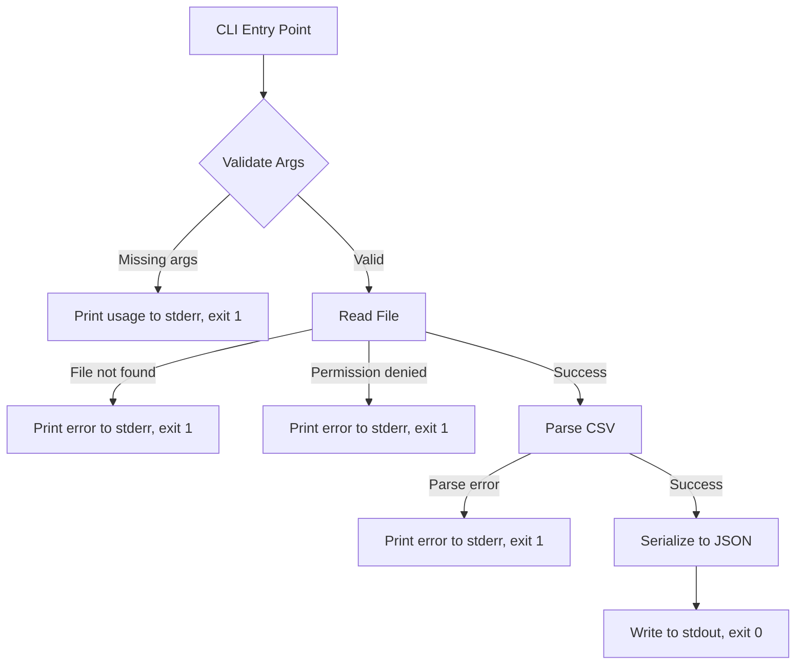
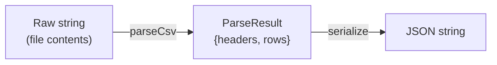
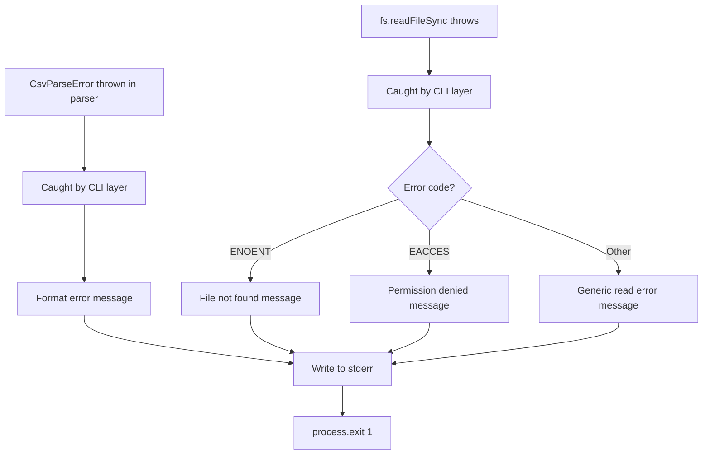

# Design Document: csv2json

## Overview

`csv2json` is a command-line tool that reads a CSV file and produces a JSON array of objects on standard output. Each CSV data row becomes a JSON object keyed by the header row's column names. The tool supports a `--pretty` flag for indented output.

The implementation follows a pipeline architecture: **CLI argument parsing → file reading → CSV parsing → JSON serialization → output**. Each stage is a discrete, testable unit with clear input/output boundaries.

### Design Goals

- Correct handling of RFC 4180-style CSV (quoted fields, embedded commas, escaped quotes, embedded newlines)
- Predictable error reporting to stderr with non-zero exit codes
- Minimal dependencies — use Node.js built-in `fs` module for file I/O and a custom parser for CSV
- Clean separation between I/O (CLI layer) and pure logic (parser + serializer)

## Architecture



The architecture separates concerns into three layers:

1. **CLI Layer** — argument parsing, file I/O, error reporting, exit codes
2. **Parser Layer** — pure function: `string → Row[]` (or throws parse error)
3. **Serializer Layer** — pure function: `(headers, rows, options) → string`

This separation means the parser and serializer can be tested independently with property-based tests without touching the file system.

## Components and Interfaces

### 1. CLI Module (`src/cli.ts`)

Responsible for orchestrating the pipeline and handling all I/O concerns.

```typescript
// Entry point
function main(args: string[]): void;
```

**Responsibilities:**
- Parse CLI arguments (positional file path, optional `--pretty` flag)
- Read the file from disk
- Delegate to parser and serializer
- Write output to stdout or error messages to stderr
- Set process exit code

### 2. Parser Module (`src/parser.ts`)

Pure function that converts a CSV string into structured data.

```typescript
interface ParseResult {
  headers: string[];
  rows: string[][];
}

// Throws CsvParseError on invalid input
function parseCsv(input: string): ParseResult;
```

**Responsibilities:**
- Extract the header row
- Parse each data row respecting quoting rules (RFC 4180)
- Handle embedded commas, embedded newlines, escaped double quotes
- Validate column count consistency (extra fields → error; fewer fields → pad with empty strings)
- Detect and reject empty/whitespace-only files
- Detect unclosed quotes

### 3. Serializer Module (`src/serializer.ts`)

Pure function that converts parsed data into a JSON string.

```typescript
interface SerializeOptions {
  pretty: boolean;
}

function serialize(headers: string[], rows: string[][], options: SerializeOptions): string;
```

**Responsibilities:**
- Build an array of objects from headers + rows
- Produce compact JSON (no whitespace) or pretty JSON (2-space indent)
- Terminate output with a trailing newline
- All cell values are strings (including empty cells as `""`)

### 4. Error Types (`src/errors.ts`)

```typescript
class CsvParseError extends Error {
  constructor(message: string);
}
```

## Data Models

### Internal Data Flow



### ParseResult

| Field   | Type       | Description                                     |
|---------|------------|-------------------------------------------------|
| headers | `string[]` | Column names from the header row                |
| rows    | `string[][]` | Array of data rows, each row is array of cell values |

### Row Object (JSON output)

Each element in the JSON array output is an object where:
- Keys are the header values (preserving original casing and whitespace)
- Values are always strings (cell content after quote/escape processing, or `""` for missing trailing fields)

### SerializeOptions

| Field  | Type      | Description                              |
|--------|-----------|------------------------------------------|
| pretty | `boolean` | Whether to use 2-space indented JSON output |

### Exit Codes

| Code | Meaning             |
|------|---------------------|
| 0    | Success             |
| 1    | Any error condition |

## Correctness Properties

*A property is a characteristic or behavior that should hold true across all valid executions of a system — essentially, a formal statement about what the system should do. Properties serve as the bridge between human-readable specifications and machine-verifiable correctness guarantees.*

### Property 1: CSV Parse Round-Trip

*For any* arbitrary string value (including strings with commas, double quotes, newlines, and leading/trailing whitespace), properly encoding it as a CSV cell (quoting and escaping as needed) and then parsing it back with the Parser SHALL recover the original string value exactly.

**Validates: Requirements 5.1, 5.2, 5.3, 5.4, 5.5, 5.7**

### Property 2: Structural Integrity

*For any* valid CSV file with M header columns and N data rows, parsing and serializing SHALL produce a JSON array of exactly N objects where each object contains exactly M keys, and those keys are exactly the header values.

**Validates: Requirements 1.2, 2.1, 2.3, 6.1, 6.3**

### Property 3: Row Order Preservation

*For any* valid CSV file with multiple data rows, the order of objects in the output JSON array SHALL match the order of the corresponding rows in the CSV input.

**Validates: Requirements 2.2**

### Property 4: Short Row Padding

*For any* valid CSV file where a data row contains fewer fields than the header row, the resulting JSON object SHALL have empty string values (`""`) for each missing trailing field, producing an object with the same number of keys as the header count.

**Validates: Requirements 2.6**

### Property 5: Serialization Round-Trip

*For any* valid (headers, rows) data produced by the Parser, serializing to JSON and parsing the output with `JSON.parse` SHALL produce an array of objects with values identical to the original row data.

**Validates: Requirements 6.2, 2.4**

### Property 6: Output Formatting Correctness

*For any* valid input data, when `pretty` is false the serialized output SHALL contain no whitespace between JSON tokens (outside of string values), when `pretty` is true the output SHALL be indented with 2 spaces, and in both modes the output SHALL terminate with exactly one trailing newline character.

**Validates: Requirements 3.1, 3.2, 3.3**

## Error Handling

### Error Categories and Messages

| Condition | stderr Message Pattern | Exit Code |
|-----------|----------------------|-----------|
| Missing file path argument | `Usage: csv2json <file> [--pretty]` | 1 |
| File not found | `Error: File not found: <path>` | 1 |
| Permission denied | `Error: Cannot read file: <path>` | 1 |
| Empty file (0 bytes) | `Error: File is empty: <path>` | 1 |
| Whitespace-only file | `Error: File is empty: <path>` | 1 |
| Malformed CSV (unclosed quote) | `Error: CSV parse error: unclosed quote at line <n>` | 1 |
| Column count mismatch (too many) | `Error: CSV parse error: row <n> has more fields than header` | 1 |

### Error Handling Strategy

1. **Fail fast**: Validate arguments before doing any file I/O. Validate file accessibility before parsing.
2. **Specific messages**: Each error condition produces a distinct, actionable message so users know how to fix the problem.
3. **Consistent output channel**: All errors go to stderr; only successful JSON output goes to stdout. This allows piping `csv2json file.csv | jq .` without error messages corrupting the JSON stream.
4. **Single exit code**: All failures exit with code 1. This keeps the interface simple — scripts can check `$?` for success/failure without needing to interpret multiple codes.

### Error Propagation



## Testing Strategy

### Property-Based Tests (fast-check)

The project will use [fast-check](https://github.com/dubzzz/fast-check) for property-based testing in TypeScript/Node.js.

**Configuration:**
- Minimum 100 iterations per property test
- Each test tagged with its design property reference

**Properties to implement:**

| Property | Test Description | Tag |
|----------|-----------------|-----|
| 1 | Generate random strings, CSV-encode, parse, verify recovery | `Feature: csv2json, Property 1: CSV Parse Round-Trip` |
| 2 | Generate random headers/rows, convert, verify structure | `Feature: csv2json, Property 2: Structural Integrity` |
| 3 | Generate multi-row CSVs, verify output order matches input | `Feature: csv2json, Property 3: Row Order Preservation` |
| 4 | Generate rows shorter than headers, verify padding | `Feature: csv2json, Property 4: Short Row Padding` |
| 5 | Generate data, serialize, JSON.parse, compare | `Feature: csv2json, Property 5: Serialization Round-Trip` |
| 6 | Generate data, serialize in both modes, verify formatting rules | `Feature: csv2json, Property 6: Output Formatting Correctness` |

### Unit Tests (example-based)

| Area | Test Cases |
|------|-----------|
| CLI arguments | Missing arg → usage message; `--pretty` flag parsed correctly |
| File errors | Non-existent file → error; permission denied → error |
| Empty file | 0-byte file → error; whitespace-only → error |
| Header only | Header with no data rows → `[]\n` |
| Pretty + header only | Header only with `--pretty` → `[]\n` |
| Unclosed quote | Malformed CSV → parse error |
| Extra columns | Row with more fields than header → error |
| End-to-end | Valid CSV → correct JSON on stdout, exit 0 |

### Test File Structure

```
tests/
├── parser.property.test.ts   # Property tests for parser (Properties 1, 2, 3, 4)
├── serializer.property.test.ts # Property tests for serializer (Properties 5, 6)
├── parser.test.ts            # Unit tests for parser edge cases
├── serializer.test.ts        # Unit tests for serializer edge cases
└── cli.test.ts               # Integration tests for CLI layer
```

### Test Runner

- **vitest** — fast, TypeScript-native, compatible with fast-check
- Run with `vitest --run` for single execution in CI

